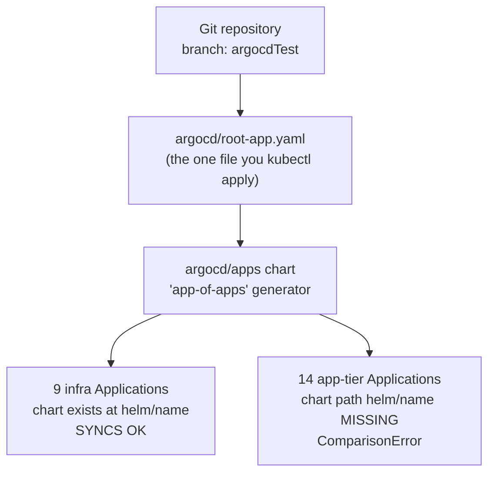
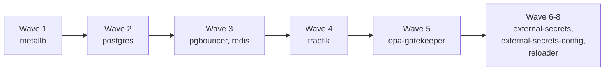

# NitroBerry Platform — Infrastructure Repository

GitOps-driven Kubernetes infrastructure for the NitroBerry Platform.
Bootstraps a single-node `kubeadm` cluster (tested on Oracle Cloud ARM/
aarch64 VMs) and hands it to ArgoCD, which then owns everything else via
the "app-of-apps" pattern.

> **Note on this README:** an earlier version of this document described
> infra Helm charts being pushed to and pulled from AWS ECR as OCI
> packages. That is no longer how this repo works — `reviewcomments.md`
> in this repo confirms a refactor moved infra charts to be sourced
> directly from Git. This README reflects the code as it actually runs
> today, verified against `argocd/apps/templates/applications.yaml`
> directly, not against older prose.

---

## 1. Architecture

### 1.1 GitOps entry point

Only one file is ever applied by hand: `argocd/root-app.yaml`. Everything
else is generated and reconciled by ArgoCD automatically
(`prune: true`, `selfHeal: true`).



### 1.2 Sync-wave ordering (infra tier)

Each generated Application carries a sync-wave annotation. ArgoCD applies
lower waves first and waits for health before moving on — this is the
dependency ordering, expressed declaratively:



### 1.3 Where each chart's source actually comes from

For every generated Application, ArgoCD resolves `source.path` as
`helm/<chart-name-without-"-helm">` **in this same Git repo** — not from
ECR. Two charts (`external-secrets`, `reloader`) additionally vendor a
real upstream chart as a Helm dependency (`charts.external-secrets.io`,
`stakater-charts`), so ArgoCD's repo-server needs outbound internet access
to resolve those.

---

## 2. Known limitation — read before deploying

**The 7 application services (14 ArgoCD Applications, counting workers)
will not deploy from this repo alone:**

```
auth-api, auth-worker, cockpit-api, cockpit-worker, messenger-api,
social-api, social-worker, task-api, task-worker, vault-api,
vault-worker, workflow-api, workflow-worker
```

Their `values.yaml` entries exist (so ArgoCD creates the Application
objects), but the chart source folders they point to — `helm/auth-api`,
`helm/cockpit-api`, etc. — do not exist anywhere in this repo.
`reviewcomments.md` confirms these charts were deliberately moved out to
each service's own application repo. Expect `ComparisonError` / missing-
path errors for all 14 — this is not fixable by re-running any script
here. It requires pulling those charts in from wherever the actual
application repos publish them.

Other things worth knowing:
- **ARM/aarch64:** the bootstrap scripts detect and handle this correctly.
  If app-tier charts are added later, watch for `exec format error` in pod
  logs — that means an amd64-only image landed on this ARM node.
- **ArgoCD UI exposure:** don't open port 8080 publicly. Use an SSH tunnel
  (`deploy-scripts/11-access-argocd-ui.sh`).
- **Service names have a `-service` suffix** — see the table in section 5.

---

## 3. Repository structure — what every file does

```
.
├── argocd/
│   ├── root-app.yaml
│   └── apps/
│       ├── Chart.yaml
│       ├── values.yaml
│       ├── chart-tags.yaml
│       └── templates/applications.yaml
├── helm/
│   ├── ecr-helper.yaml
│   ├── metallb/
│   ├── postgres/
│   ├── redis/
│   ├── pgbouncer/
│   ├── traefik/
│   ├── opa-gatekeeper/
│   ├── external-secrets/
│   ├── external-secrets-config/
│   └── reloader/
├── script/
│   ├── deploy-production.sh
│   ├── port-forward.sh
│   └── installation/
│       ├── setup-vm.sh
│       └── ecr-helper.yaml
├── deploy-scripts/
│   └── (00-config.env, 01–14 numbered scripts)
├── reviewcomments.md
├── nitroberry_full_production_arch.jpg
└── .gitignore
```

### 3.1 `argocd/` — GitOps orchestration

| File | Purpose |
|---|---|
| `root-app.yaml` | The one Application you `kubectl apply` manually. Points at `path: argocd/apps`. Everything downstream is generated from this. |
| `apps/Chart.yaml` | Metadata only — marks `argocd/apps/` as a valid Helm chart. |
| `apps/values.yaml` | The real config: every service mapped to namespace, sync wave, and Helm overrides (replica count, probe paths, HPA). Edit this to add/remove/reconfigure a service. |
| `apps/chart-tags.yaml` | Version tag per service, kept separate so CI/CD can bump one service without touching `values.yaml`. |
| `apps/templates/applications.yaml` | The template that loops over `values.yaml` and generates one ArgoCD Application per entry, sourced from `helm/<name>` in this repo. |

### 3.2 `helm/` — the 9 real infra charts

| Chart | What it deploys | Image / source |
|---|---|---|
| `metallb/` | Bare-metal LoadBalancer support | `metallb-native.yaml` upstream manifest |
| `postgres/` | Primary database, single StatefulSet | `postgres:15-alpine` |
| `redis/` | Cache/queue backend | `redis` (public) |
| `pgbouncer/` | Connection pooler in front of Postgres | `ghcr.io/icoretech/pgbouncer-docker` |
| `traefik/` | Ingress controller | `traefik:v3.0` |
| `opa-gatekeeper/` | Policy enforcement (admission control) | policy templates only, no image bundled here |
| `external-secrets/` | External Secrets Operator | vendors `charts.external-secrets.io` as a dependency |
| `external-secrets-config/` | ClusterSecretStore pointing at Azure Key Vault | config only |
| `reloader/` | Restarts pods when their Secret/ConfigMap changes | vendors `stakater-charts` as a dependency |
| `ecr-helper.yaml` (loose file, not a chart) | Duplicate of `script/installation/ecr-helper.yaml` — the one actually applied lives under `script/installation/`. |

### 3.3 `script/` — bootstrap and operational scripts

| File | Purpose |
|---|---|
| `installation/setup-vm.sh` | Main bootstrap: installs Helm/containerd/kubeadm, inits the cluster, installs Flannel, ArgoCD, MetalLB, creates the initial ECR secret, applies `root-app.yaml`. |
| `installation/ecr-helper.yaml` | A CronJob (applied by `setup-vm.sh`) that runs every 6 hours: refreshes the ECR login token, rebuilds ArgoCD's OCI-repo credentials (currently dormant — see note below), creates all 13 namespaces if missing, and refreshes `ecr-regcred`/`ecr-registry-secret` pull secrets in each. Uses `heyvaldemar/aws-kubectl` (multi-arch, works on ARM) — the original `odaniait/aws-kubectl` image is amd64-only and crashes with `exec format error` on aarch64. |
| `deploy-production.sh` | Post-bootstrap verification: installs the storage class, distributes ECR secrets, forces an ArgoCD sync, waits for pod readiness, reports final sync status. |
| `port-forward.sh` | Manual convenience script for local access to Traefik/Postgres/Redis/PgBouncer/ArgoCD UI. Uses the correct `-service`-suffixed names. |

**Note on `ecr-helper.yaml`'s OCI-repository registration:** part of what
this CronJob does (patching `argocd-cm` with `repositories:` /
`repository.credentials:` for an ECR OCI Helm registry) is currently
unused — the active app-of-apps template sources charts from Git, not
OCI. It's harmless, just latent scaffolding from before the refactor.

### 3.4 `deploy-scripts/` — step-by-step runnable scripts

| File | Purpose |
|---|---|
| `00-config.env` | Shared settings every script below reads automatically (`AWS_REGION`, `POSTGRES_PASSWORD`, `REPO_DIR`, etc.). Edit this first. |
| `01-verify-vm-architecture.sh` | Confirms `aarch64`/`x86_64`, checks `sudo`. No dependencies. |
| `02-install-base-packages.sh` | Installs `curl`, `unzip`, `git`, `jq`. |
| `03-install-aws-cli.sh` | Installs AWS CLI v2, correct build for detected architecture. |
| `04-configure-aws-credentials.sh` | Runs `aws configure`, verifies with `aws sts get-caller-identity`. |
| `05-clone-repository.sh` | Clones (or pulls latest into) `REPO_DIR`, checks out `argocdTest`. |
| `06-set-environment-variables.sh` | Validates `00-config.env` before the long bootstrap runs. |
| `07-run-setup-vm-script.sh` | Runs the repo's real `script/installation/setup-vm.sh`. 15–25 min. |
| `08-verify-cluster-and-argocd.sh` | Checks node/ArgoCD/MetalLB/Flannel health, confirms the ECR account ID substitution. |
| `09-run-deploy-production-script.sh` | Runs the repo's real `script/deploy-production.sh`. |
| `10-verify-argocd-application-sync.sh` | Checks every Application against what's actually expected (infra should sync, app-tier will error). |
| `11-access-argocd-ui.sh` | Prints the admin password and the SSH-tunnel commands for safe UI access. |
| `12-access-services-port-forward.sh` | Backgrounds port-forwards for the infra services, with logs. |
| `13-troubleshooting.sh` | Interactive menu for common failure modes. |
| `14-run-all.sh` | Walks through `01`–`10` automatically, pausing after each step. |

### 3.5 Other files

| File | Purpose |
|---|---|
| `reviewcomments.md` | Historical record of the infra/app-chart split refactor — the source of truth for why the app-tier charts aren't in this repo. |
| `nitroberry_full_production_arch.jpg` | Reference architecture image. |
| `.gitignore` | Excludes `helm/**/charts/`, `helm/**/Chart.lock`, `*.tgz`, and `deploy-scripts/00-config.env` (so real secrets in your local copy of the config file are never committed). |

---

## 4. Step-by-step setup

Everything below lives in `deploy-scripts/`. Run in order from inside that
folder on the target VM.

```bash
# 0. Edit 00-config.env first — set a real POSTGRES_PASSWORD

# 1. Confirm architecture and sudo access
./01-verify-vm-architecture.sh

# 2. Install curl, unzip, git, jq
./02-install-base-packages.sh

# 3. Install AWS CLI (matches detected architecture)
./03-install-aws-cli.sh

# 4. Configure and verify AWS credentials
./04-configure-aws-credentials.sh

# 5. Clone the repo
./05-clone-repository.sh

# 6. Validate environment variables from 00-config.env
./06-set-environment-variables.sh

# 7. Bootstrap the cluster (15-25 min)
./07-run-setup-vm-script.sh

# 8. Verify cluster + ArgoCD came up healthy
./08-verify-cluster-and-argocd.sh

# 9. Run production verification / force sync
./09-run-deploy-production-script.sh

# 10. Check what actually synced
./10-verify-argocd-application-sync.sh

# 11. Access the ArgoCD UI (manual, foreground — run when ready)
./11-access-argocd-ui.sh

# 12. Start background port-forwards to infra services
./12-access-services-port-forward.sh
```

Or run `./14-run-all.sh` to walk through steps 1–10 automatically, pausing
after each one so you can check output before continuing.

Use `./13-troubleshooting.sh` any time something looks wrong — it's an
interactive menu, not part of the numbered sequence.

---

## 5. Expected result after a full run

```bash
kubectl get applications -n argocd
```

| Tier | Applications | Expected status |
|---|---|---|
| Infra | metallb, postgres, redis, pgbouncer, traefik, opa-gatekeeper, external-secrets, external-secrets-config, reloader | `Synced` / `Healthy` |
| Application | auth-api/-worker, cockpit-api/-worker, messenger-api, social-api/-worker, task-api/-worker, vault-api/-worker, workflow-api/-worker | `ComparisonError` (expected — see section 2) |

### Correct Kubernetes Service names

The infra charts create Services with a `-service` suffix:

| Service | Namespace |
|---|---|
| `svc/postgres-service` | `database-namespace` |
| `svc/redis-service` | `database-namespace` |
| `svc/pgbouncer-service` | `database-namespace` |
| `svc/traefik-service` | `traefik-ingress` |

---

## 6. Updating a service version

1. Edit `argocd/apps/chart-tags.yaml`, bump the version string for the
   relevant infra chart.
2. Commit and push to `argocdTest`.
3. ArgoCD detects the change automatically (polling, or immediately with
   `argocd.argoproj.io/refresh=hard`), pulls the updated chart from Git,
   and rolls out the change.

To force an immediate refresh instead of waiting for polling:
```bash
kubectl annotate application -n argocd nitroberry-platform-apps \
  argocd.argoproj.io/refresh=hard --overwrite
```

---

## 7. Troubleshooting quick index

Run `deploy-scripts/13-troubleshooting.sh` for an interactive version of
all of these:

| Symptom | Fix |
|---|---|
| AWS/ECR auth error mid-script | `aws configure` then `aws sts get-caller-identity`, re-run the failed script |
| `ImagePullBackOff` | Re-run `deploy-production.sh` to redistribute pull secrets |
| Pod stuck `Pending` | `kubectl describe pod <name> -n <ns>`, check Events |
| Application `OutOfSync` | `kubectl annotate application <name> -n argocd argocd.argoproj.io/refresh=hard --overwrite` |
| Application `ComparisonError` (app-tier) | Expected — see section 2 |
| Application `ComparisonError` (infra-tier) | Unexpected — `kubectl describe application <name> -n argocd`, confirm `helm/<name>/Chart.yaml` exists |
| `kubeadm init` fails | Check `free -h` shows 0 swap, `systemctl status containerd`, `sudo kubeadm reset` if a partial cluster exists |
| Can't access ArgoCD UI | Confirm you're using the SSH tunnel, not a public port; confirm the port-forward terminal is still open |
| `exec format error` in logs | Wrong CPU architecture image (amd64 on this ARM node) — needs a matching rebuild |