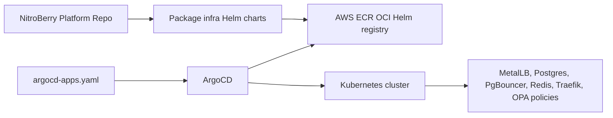

# NitroBerry Platform Infrastructure

This repository now owns the Kubernetes platform layer only. API and worker Helm charts are expected to live with their respective application repositories.

## Current Responsibility

- Deploys platform infrastructure Helm charts for MetalLB config, Postgres, PgBouncer, Redis, Traefik, and OPA Gatekeeper policies.
- Defines ArgoCD `Application` resources that pull those infrastructure charts from AWS ECR as OCI Helm charts.
- Keeps production secret values out of Git. Runtime secrets are created by `setup-vm.sh` or should be supplied by your production secret-management system.

## Helm Chart Layout

```text
helm/
  argocd-apps/
    values.yaml
    chart-tags.yaml
    templates/
  helm/
    metallb/
    postgres/
    pgbouncer/
    redis/
    traefik/
    opa-gatekeeper/
  ecr-helper.yaml
  push-infra-charts.sh
```

## ECR Helm Repositories

Each chart is packaged locally and pushed to AWS ECR as an OCI Helm chart. Helm pushes to the parent OCI path:

```bash
helm push postgres-helm-1.0.0.tgz \
  oci://<AWS_ACCOUNT_ID>.dkr.ecr.<AWS_REGION>.amazonaws.com/nitroberry
```

Because Helm appends the chart name, ECR must have repositories like:

```bash
aws ecr create-repository --repository-name nitroberry/metallb-helm --region ap-south-1
aws ecr create-repository --repository-name nitroberry/postgres-helm --region ap-south-1
aws ecr create-repository --repository-name nitroberry/pgbouncer-helm --region ap-south-1
aws ecr create-repository --repository-name nitroberry/redis-helm --region ap-south-1
aws ecr create-repository --repository-name nitroberry/traefik-helm --region ap-south-1
aws ecr create-repository --repository-name nitroberry/opa-gatekeeper-helm --region ap-south-1
```

The helper script automatically creates missing ECR repositories (appended with the `-helm` suffix) and pushes all infrastructure charts:

```bash
./helm/push-infra-charts.sh ap-south-1
```

## ArgoCD Flow



`argocd-apps.yaml` bootstraps the `helm/argocd-apps` app-of-apps chart. That chart creates the platform ArgoCD Applications that point to ECR.

Only `helm/argocd-apps/chart-tags.yaml` should be updated by automation when a platform Helm chart version changes:

```yaml
chartTags:
  postgres: "1.0.0"
```

The rest of the ArgoCD Application definition stays stable. App API and worker deployments should be controlled by their own application repos and ArgoCD apps.

## VM Bootstrap

Run this on the target Ubuntu VM:

```bash
chmod +x setup-vm.sh
./setup-vm.sh
```

The script:

- Installs base tools only when missing.
- Installs Kubernetes only when no reachable cluster is found.
- Installs Helm only when missing.
- Installs ArgoCD if it is not already present.
- Configures AWS ECR access tokens and runs `ecr-helper.yaml` CronJob to refresh secrets automatically across namespaces.
- Pre-creates database credentials placeholders securely in the `database-namespace` namespace.
- Installs MetalLB network operator in the cluster explicitly.
- Applies `argocd-apps.yaml` so ArgoCD starts syncing the parent infra app-of-apps chart.

## Secrets

Do not commit real secret values to this repo. Production values should live in one of these places:

- Kubernetes Secrets created by the bootstrap process.
- AWS Secrets Manager plus External Secrets Operator.
- Sealed Secrets or SOPS-encrypted values if the team wants Git-managed encrypted secrets.

This repo should contain only placeholders, chart templates, and non-sensitive configuration.

## Production Notes

- Update the MetalLB IP range in `helm/helm/metallb/values.yaml` for the VM/network.
- Replace the default Traefik ACME email and JWT middleware secret through chart values before production.
- Ensure app repos create their own API/worker ConfigMaps, Secrets, image tags, and ArgoCD Applications.
- Update only `helm/argocd-apps/chart-tags.yaml` when a platform Helm chart version changes.
- ArgoCD's ECR OCI token is bootstrapped by `setup-vm.sh`; for long-running production, the `ecr-token-refresher` CronJob automatically refreshes ECR tokens every 6 hours in the cluster.
