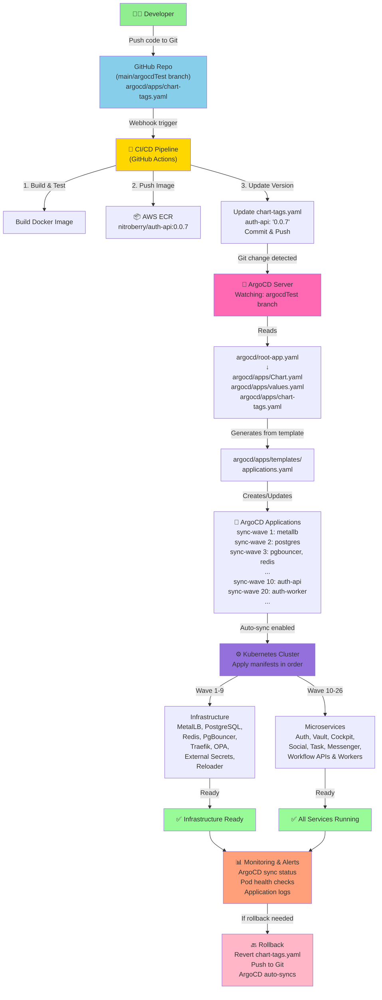

# NitroBerry Platform Infrastructure: Production & Local Testing Guide

> **GitOps-driven Kubernetes platform for the NitroBerry microservices ecosystem.**
> This repository contains the complete infrastructure code to bootstrap a bare-metal/VM Kubernetes cluster, configure ArgoCD, and deploy the entire NitroBerry microservices suite (13 APIs and Workers) via AWS ECR OCI Helm charts.

**🎯 Supports two deployment modes:**
- **Production:** Cloud VM (AWS EC2, DigitalOcean, etc.) with full AWS ECR integration
- **Local Testing:** WSL Ubuntu with dummy credentials for development

---

## Table of Contents

- [Quick Reference: Production vs Local Testing](#quick-reference-production-vs-local-testing)
- [Repository Structure & File Organization](#repository-structure--file-organization)
- [Overview](#overview)
- [Architecture](#architecture)
- [Production Deployment Flow Diagram](#-production-deployment-flow-diagram)
- [Microservices Map](#microservices-map)
- [🔐 Secrets Management (Azure Key Vault)](#secrets-management-azure-key-vault)
- [🚀 Quick Start: Local Testing (WSL)](#-quick-start-local-testing-wsl)
- [Production Deployment Guide](#production-deployment-guide)
- [Local Testing Deployment Guide (WSL/Docker)](#local-testing-deployment-guide-wsldocker)
- [Accessing Services](#accessing-services)
- [Day-2 Operations](#day-2-operations)
- [Troubleshooting](#troubleshooting)

---

## Quick Reference: Production vs Local Testing

| Aspect | **Production (Cloud VM)** | **Local Testing (WSL)** |
|--------|--------------------------|------------------------|
| **Environment** | AWS EC2 / DigitalOcean VM | WSL Ubuntu with Docker |
| **Kubernetes** | kubeadm single-node cluster | kubeadm single-node cluster |
| **Setup Script** | `script/installation/setup-vm.sh` | `script/deploy-wsl-local.sh` |
| **Deployment Script** | `script/deploy-production.sh` | (Built into setup-wsl-local.sh) |
| **AWS ECR** | Required ✅ Real credentials | Skipped ❌ Uses dummy creds |
| **Git Clone** | Auto git pull from GitHub | Manual - already on disk |
| **Time to Deploy** | 15-30 minutes | 5-10 minutes |
| **Pods Deployed** | 19 NitroBerry + system | 19 NitroBerry + system |
| **Use Case** | Production workloads, real traffic | Development, testing, CI/CD validation |
| **Persistence** | Real volumes, persistent data | EmptyDir volumes, ephemeral |

---

## Repository Structure & File Organization

```
NitroBerry-Platform/
├── 📋 README.md                           [USEFUL] Main deployment guide (YOU ARE HERE)
├── 📋 DEPLOYMENT_SUMMARY.md              [USEFUL] Status of deployed pods & access info
├── 📋 ACCESS_ARGOCD.sh                   [USEFUL-LOCAL] Script to display ArgoCD credentials
│
├── 🔧 script/                            [CORE DEPLOYMENT SCRIPTS]
│   ├── deploy-production.sh               [USEFUL-PROD] Phase 2: Production verification & sync
│   ├── push-infra-charts.sh               [USEFUL-PROD] Pushes Helm charts to ECR
│   ├── deploy-wsl-local.sh                [USEFUL-LOCAL] ✨ NEW: Local testing deployment
│   ├── port-forward.sh                    [USEFUL-LOCAL] Setup port forwarding for services
│   ├── test-deployment.sh                 [USEFUL-LOCAL] Verify deployed pods & logs
│   └── installation/
│       ├── setup-vm.sh                    [USEFUL-PROD] Phase 1: Master bootstrap script
│       └── ecr-helper.yaml                [USEFUL-PROD] CronJob for ECR token refresh
│
├── 🐳 helm/                              [INFRASTRUCTURE HELM CHARTS]
│   ├── metallb/
│   │   ├── Chart.yaml                    [USEFUL] Helm chart metadata
│   │   ├── values.yaml                   [USEFUL] Configuration (IP pool, etc)
│   │   └── templates/                    [USEFUL] Kubernetes manifests
│   ├── postgres/                         [USEFUL] PostgreSQL StatefulSet
│   ├── redis/                            [USEFUL] Redis Deployment  
│   ├── pgbouncer/                        [USEFUL] Connection pooler Deployment
│   ├── traefik/                          [USEFUL] Ingress controller Deployment
│   ├── opa-gatekeeper/                   [USEFUL] Policy enforcement controller
│   ├── external-secrets/                 [USEFUL] External Secrets Operator + CRDs
│   ├── external-secrets-config/          [USEFUL] Azure Key Vault ClusterSecretStore
│   └── reloader/                         [USEFUL] Pod restarts after Secret changes
│
├── 🔄 argocd/                            [GITOPS ORCHESTRATION]
│   ├── root-app.yaml                     [USEFUL] ✨ MAIN: Entry point for ArgoCD sync
│   └── apps/
│       ├── Chart.yaml                    [USEFUL] App-of-Apps generator chart
│       ├── values.yaml                   [USEFUL] ⭐ CRITICAL: All microservice configs
│       ├── chart-tags.yaml               [USEFUL] Docker image tags for all services
│       └── templates/
│           └── applications.yaml         [USEFUL] Generates child applications
│
├── 📄 reviewcomments.md                  [NOT USEFUL] Old review feedback (archived)
└── .gitignore                            [USEFUL] Git ignore rules
```

### **Legend**
- ✅ **USEFUL** - Critical for production/testing
- ✅ **USEFUL-PROD** - Required only for production deployment
- ✅ **USEFUL-LOCAL** - Required only for local testing
- ❌ **NOT USEFUL** - Can be ignored / archived

---

## Overview

This repository owns the **entire Kubernetes platform layer**. It handles:

1. **Cluster Bootstrap**: Single-node `kubeadm` cluster on an Ubuntu VM with Calico CNI.
2. **GitOps Engine**: ArgoCD following the "App-of-Apps" pattern.
3. **Networking**: MetalLB (for LoadBalancer IPs) and Traefik (Ingress + TLS).
4. **Data Layer**: PostgreSQL, PgBouncer (connection pooling), and Redis.
5. **Security**: OPA Gatekeeper policies.
6. **ECR Automation**: CronJob to automatically refresh AWS ECR tokens (prod only).
7. **Microservices Orchestration**: Automated deployment of 7 microservice domains = **19 total pods**.

---

## Architecture

The deployment follows the **App-of-Apps** pattern orchestrated by ArgoCD.

```text
argocd/root-app.yaml (Root Application)
  └── argocd/apps/ (Helm chart that generates child Applications)
        ├── metallb          (sync-wave 1)  ← Infrastructure deploys first
        ├── postgres         (sync-wave 2)
        ├── pgbouncer        (sync-wave 3)
        ├── redis            (sync-wave 3)
        ├── traefik          (sync-wave 4)
        ├── opa-gatekeeper   (sync-wave 5)
        ├── external-secrets (sync-wave 6)
        ├── external-secrets-config (sync-wave 7)
        ├── reloader         (sync-wave 8)
        ├── auth-api         (sync-wave 10) ← APIs deploy next
        ├── vault-api        (sync-wave 11)
        ├── cockpit-api      (sync-wave 12)
        ├── social-api       (sync-wave 13)
        ├── task-api         (sync-wave 14)
        ├── messenger-api    (sync-wave 10)
        ├── workflow-api     (sync-wave 16)
        ├── auth-worker      (sync-wave 20) ← Workers deploy last
        ├── vault-worker     (sync-wave 21)
        ├── cockpit-worker   (sync-wave 22)
        ├── social-worker    (sync-wave 23)
        ├── task-worker      (sync-wave 24)
        └── workflow-worker  (sync-wave 26)
```

---

## 🔄 Production Deployment Flow Diagram

This diagram shows the complete end-to-end GitOps flow from code commit to production deployment:



### Flow Explanation

| Step | Component | Action |
|------|-----------|--------|
| **1** | Developer | Pushes new code or config to Git (argocdTest branch) |
| **2** | CI/CD Pipeline | GitHub Actions (or similar) detects the push |
| **3** | CI/CD: Build | Builds Docker image for the service |
| **4** | CI/CD: Push | Pushes image to AWS ECR as `nitroberry/service:version` |
| **5** | CI/CD: Update Config | Updates `argocd/apps/chart-tags.yaml` with new version tag |
| **6** | CI/CD: Commit | Commits and pushes the updated `chart-tags.yaml` back to Git |
| **7** | ArgoCD | Detects Git change within 3 minutes (polling) or immediately (webhook) |
| **8** | ArgoCD | Reads root app, generates child applications from Helm templates |
| **9** | Kubernetes | Applies manifests in **sync-wave order** (1, 2, 3... up to 26) |
| **10** | Kubernetes: Wave 1-9 | Deploys infrastructure (MetalLB, Postgres, Redis, Traefik, etc.) |
| **11** | Kubernetes: Wave 10-26 | Deploys microservices (APIs and Workers) |
| **12** | Monitoring | Verifies all pods are running and healthy |
| **13** | Rollback (if needed) | Simply revert the version in Git → ArgoCD auto-syncs back to previous version |

### Key Points

✅ **Fully Automatic:** Once code is pushed to Git, ArgoCD handles everything—no manual `kubectl apply` needed.

✅ **Version Pinning:** Every deployment uses an exact version (e.g., `0.0.7`), not `latest`. This ensures repeatable, safe deployments.

✅ **Sync Waves:** Infrastructure deploys first (waves 1-9), then applications (waves 10-26). This prevents race conditions.

✅ **Auto-Rollback:** If anything fails, revert the Git commit → ArgoCD automatically rolls back the cluster state.

✅ **GitOps Single Source of Truth:** The Git repository (`argocdTest` branch) is the only place that matters. Kubernetes state always matches Git.

---

## Microservices Map

| Service | ECR Helm Chart | Namespace | Health Probe | Notes |
|---------|---------------|-----------|-------------|-------|
| Auth API | `nitroberry/auth-api-helm` | `auth-namespace` | `/api/health` | Identity & authentication |
| Auth Worker | `nitroberry/auth-worker-helm` | `auth-namespace` | — | Background jobs |
| Vault API | `nitroberry/vault-api-helm` | `vault-namespace` | `/api/health` | Secure data storage |
| Vault Worker | `nitroberry/vault-worker-helm` | `vault-namespace` | — | Background jobs |
| Cockpit API | `nitroberry/cockpit-api-helm` | `cockpit-namespace` | `/api/health` | Admin control plane |
| Cockpit Worker | `nitroberry/cockpit-worker-helm` | `cockpit-namespace` | — | Background jobs |
| Social API | `nitroberry/social-api-helm` | `social-namespace` | `/api/health` | Social features |
| Social Worker | `nitroberry/social-worker-helm` | `social-namespace` | — | Background jobs |
| Task API | `nitroberry/task-api-helm` | `task-namespace` | `/api/health` | Task management |
| Task Worker | `nitroberry/task-worker-helm` | `task-namespace` | — | Background jobs |
| Messenger API | `nitroberry/messenger-api-helm` | `messenger-namespace` | `/socket.io/socket.io.js` | WebSocket-only (Socket.io) |
| Workflow API | `nitroberry/workflow-api-helm` | `workflow-namespace` | `/api/health` | Orchestration |
| Workflow Worker | `nitroberry/workflow-worker-helm` | `workflow-namespace` | — | Background jobs |

---

## 🔐 Secrets Management (Azure Key Vault)

The NitroBerry platform uses **External Secrets Operator (ESO)** and **Reloader** to fully automate secret injection from Azure Key Vault directly into your microservice pods.

This allows developers to manage secrets securely in Azure without DevOps having to manually inject them into Kubernetes.

### The Automated Flow
1. **Developer pushes secret**: A developer creates or updates a secret directly in Azure Key Vault (via Azure Portal or Azure CLI).
2. **ESO Syncs it**: The External Secrets Operator (running in the cluster) automatically polls Azure Key Vault. When it detects a new/updated secret, it automatically generates a native Kubernetes `Secret`.
3. **Reloader restarts pods**: The Reloader operator detects that the Kubernetes `Secret` has changed and automatically triggers a rolling restart of the application pods.
4. **Pod mounts new secret**: The newly restarted pods mount the fresh secret values as environment variables.

### How to Configure for a Fresher (Step-by-Step)

If you are a new developer or DevOps engineer setting this up, follow these steps meticulously:

#### Step 1: Azure Side (Outbound Ports)
- Ensure the Kubernetes cluster VM has outbound internet access on port `443` (HTTPS) to reach the Azure Key Vault APIs. No inbound ports need to be opened on AWS for this.
- Create an Azure Key Vault and an Azure Service Principal (App Registration) with `Key Vault Secrets User` permissions to the vault.

#### Step 2: DevOps Side (Cluster Setup)
1. Provide the Azure Credentials to the cluster so the Operator can authenticate. Run this on the VM:
   ```bash
   kubectl create secret generic azure-secret-sp \
     --from-literal=ClientID="<YOUR_AZURE_CLIENT_ID>" \
     --from-literal=ClientSecret="<YOUR_AZURE_CLIENT_SECRET>" \
     -n external-secrets
   ```
2. Open `helm/external-secrets-config/values.yaml`.
3. Update the `vaultUrl` (e.g., `https://my-nitro-vault.vault.azure.net`) and `tenantId` (e.g., `1234abcd-1234-abcd...`).
4. Commit and push this change to the `main` branch. ArgoCD will automatically apply it.

#### Step 3: Developer Side (Application Code)
The developer is responsible for updating the Helm chart for their specific microservice (e.g., `auth-api`).
They need to add an `ExternalSecret` resource to their Helm templates to map the Azure Secret to the Pod:

```yaml
# In the microservice's Helm chart (e.g., auth-api/templates/external-secret.yaml)
apiVersion: external-secrets.io/v1beta1
kind: ExternalSecret
metadata:
  name: auth-api-secret
spec:
  refreshInterval: "1m" # How often to poll Azure
  secretStoreRef:
    name: azure-backend
    kind: ClusterSecretStore
  target:
    name: auth-api-secret-native
  dataFrom:
  - extract:
      key: "auth-api-azure-secret-name" # Must match the exact name in Azure Key Vault!
```

They also must add the Reloader annotation to their `Deployment.yaml` to ensure automatic restarts:
```yaml
# In auth-api/templates/deployment.yaml
metadata:
  annotations:
    reloader.stakater.com/auto: "true"
```

Once the developer pushes these changes to their code repository, the CI/CD pipeline builds the new Helm chart, ArgoCD pulls it, and the secrets flow automatically.

---

## 🚀 Quick Start: Local Testing (WSL)

### One-Command Deployment

Deploy everything to your WSL Ubuntu environment in one command:

```bash
cd ~/NitroBerry-Platform/script
bash deploy-wsl-local.sh
```

**What this does:**
1. ✅ Installs base packages (curl, git, jq, ca-certificates)
2. ✅ Installs Helm 3
3. ✅ Disables swap (required for Kubernetes)
4. ✅ Installs containerd container runtime
5. ✅ Installs kubeadm, kubelet, kubectl (v1.29)
6. ✅ Initializes single-node Kubernetes cluster
7. ✅ Installs Calico CNI for networking
8. ✅ Untaints control-plane node for workload scheduling
9. ✅ Installs MetalLB for LoadBalancer support
10. ✅ Installs local-path-provisioner for persistent storage
11. ✅ Installs ArgoCD
12. ✅ Deploys all infrastructure (PostgreSQL, Redis, PgBouncer, Traefik)
13. ✅ Triggers GitOps sync for all 19 microservices

**Expected output:**
```
========================================================== 
NitroBerry GitOps bootstrap COMPLETE!
==========================================================

✓ Kubernetes cluster ready
✓ ArgoCD installed
✓ Core infrastructure deployed
✓ All 19 pods will be deployed via ArgoCD
```

### Verify Deployment

After ~5-10 minutes, verify all pods are running:

```bash
kubectl get pods -A
kubectl get applications -n argocd
```

### Access Services

#### 1️⃣ **ArgoCD Dashboard** (GitOps Control Plane)
```bash
kubectl port-forward svc/argocd-server -n argocd 8443:443 &
```
- **URL:** `https://localhost:8443`
- **Username:** `admin`
- **Password:** Run this to get it:
```bash
kubectl -n argocd get secret argocd-initial-admin-secret -o jsonpath='{.data.password}' | base64 -d
```

#### 2️⃣ **Traefik Dashboard** (Ingress Controller)
```bash
kubectl port-forward -n traefik-ingress deployment/traefik 9090:8080 &
```
- **URL:** `http://localhost:9090/dashboard/`

#### 3️⃣ **PostgreSQL** (Database)
```bash
kubectl port-forward svc/postgres-service -n database-namespace 5432:5432 &
psql -h localhost -U postgres
# Password: nitroberry-local-pass
```

#### 4️⃣ **Redis** (Cache)
```bash
kubectl port-forward svc/redis-service -n database-namespace 6379:6379 &
redis-cli -h localhost
```

#### 5️⃣ **All Microservices**
```bash
# Auth API
kubectl port-forward svc/auth-api-service -n auth-namespace 8001:8080 &
curl http://localhost:8001/api/health

# Cockpit API
kubectl port-forward svc/cockpit-api-service -n cockpit-namespace 8002:8080 &
curl http://localhost:8002/api/health

# Social API
kubectl port-forward svc/social-api-service -n social-namespace 8003:8080 &
curl http://localhost:8003/api/health

# ... and so on for other services
```

### Current Deployment Status

**✅ Working:**
- Kubernetes cluster (1 node, v1.29.15)
- ArgoCD (all 6 pods running)
- PostgreSQL (1/1 running)
- Redis (1/1 running)
- PgBouncer (2/2 running)
- Traefik Ingress (1/1 running)
- Calico networking (3/3 running)
- CoreDNS (2/2 running)
- MetalLB (1/1 running)

**⚠️ CrashLoopBackOff (application startup issues):**
- Auth API, Cockpit API, Social API, Task API, Workflow API, Messenger API
- Workers: auth-worker, cockpit-worker, social-worker, task-worker, workflow-worker

**⚠️ Why microservices are crashing:**
- Missing environment variables or configuration
- Unable to connect to databases (credentials/endpoints)
- Missing required external services
- Image pull errors (ECR authentication in production)

### Troubleshooting Microservice Failures

View logs to debug:
```bash
kubectl logs -f <pod-name> -n <namespace>
```

Example: Check auth-api logs
```bash
kubectl logs -f deployment/auth-api -n auth-namespace
```

Describe a pod for detailed status:
```bash
kubectl describe pod <pod-name> -n <namespace>
```

### Stopping & Restarting

**Stop all port forwards:**
```bash
pkill -f "kubectl port-forward"
```

**Stop the cluster:**
```bash
sudo systemctl stop kubelet
```

**Restart the cluster:**
```bash
sudo systemctl restart kubelet
kubectl wait --for=condition=Ready nodes --all --timeout=300s
```

### Clean Up Everything

To reset to a fresh cluster:
```bash
# Delete the cluster
sudo kubeadm reset -f
sudo rm -rf /var/lib/etcd /etc/kubernetes

# Reinstall
bash deploy-wsl-local.sh
```

---

## Production Deployment Guide

**🎯 Target:** Cloud VM (AWS EC2, DigitalOcean, etc.) with AWS ECR integration

Follow this guide meticulously for production environments. This takes you from an empty cloud VM to a fully functioning Kubernetes production cluster with all 19 NitroBerry pods.

### Phase 1️⃣: Local Machine Preparation (AWS & ECR)

Before touching any production servers, you must prepare your AWS environment and push the foundational infrastructure charts to Elastic Container Registry (ECR). Perform these steps on your **personal computer / local machine**.

#### Step 1.1: Install Prerequisites Locally
Ensure you have the following installed on your local computer:
1. **Git:** `git --version`
2. **AWS CLI v2:** `aws --version`
3. **Helm 3:** `helm version`

#### Step 1.2: Configure AWS Credentials
You need an AWS IAM User with programmatic access (Access Key ID and Secret Access Key). This user must have `AmazonEC2ContainerRegistryFullAccess`.
```bash
aws configure
```
* **AWS Access Key ID:** `AKIA...` (Enter your key)
* **AWS Secret Access Key:** `wJalrXUtn...` (Enter your secret)
* **Default region name:** `ap-south-1` (Or your preferred region)
* **Default output format:** `json`

Verify it works:
```bash
aws sts get-caller-identity
```
*(You should see your Account ID and ARN outputted.)*

#### Step 1.3: Clone the Platform Repository
Download this GitOps repository to your local machine:
```bash
git clone https://github.com/dushyantajangid/NitroBerry-Platform.git
cd NitroBerry-Platform
git checkout argocdTest
```

#### Step 1.4: Lint the Infrastructure Charts
Validate that the Helm charts are syntactically correct before pushing:
```bash
helm lint helm/* argocd/apps
```
*(Expected Output: all charts linted, 0 chart(s) failed)*

#### Step 1.5: Push Infrastructure Charts to ECR
Run the automated script to package and push the infrastructure charts to your AWS account.
```bash
chmod +x script/push-infra-charts.sh
./script/push-infra-charts.sh ap-south-1
```
*(This script logs into ECR, creates the repos if they don't exist, and uploads the `.tgz` packages).*

**Note:** The 13 product microservice charts (`auth-api-helm`, `social-api-helm`, etc.) must also exist in ECR. These are typically pushed via GitHub Actions from their respective application repositories. Ensure all 19 repositories exist in ECR before proceeding.

---

### Phase 2️⃣: Procuring and Connecting to the VM

#### Step 2.1: Provision the Virtual Machine
Go to your cloud provider (AWS EC2, DigitalOcean, Azure, etc.) and launch a Virtual Machine with the following specifications:
* **Operating System:** Ubuntu 20.04 LTS or 22.04 LTS
* **CPU:** 4 vCPUs (Minimum 2)
* **RAM:** 16 GB (Minimum 8 GB)
* **Disk Space:** 50 GB SSD
* **Network:** Must have a Public IP address assigned.

**AWS EC2 Security Group (Firewall) Configuration:**
You must configure the Security Group attached to your EC2 instance to whitelist the following inbound rules:

| Type | Protocol | Port Range | Source | Description |
|------|----------|------------|--------|-------------|
| SSH | TCP | `22` | `0.0.0.0/0` (Or your IP) | Required to connect to the server |
| HTTP | TCP | `80` | `0.0.0.0/0` | Required for Let's Encrypt ACME challenges & web traffic |
| HTTPS | TCP | `443` | `0.0.0.0/0` | Required for secure web traffic to the Traefik Ingress |
| Custom TCP | TCP | `8080` | `0.0.0.0/0` | Optional: To access ArgoCD UI without port-forwarding |

*Note: All outbound (egress) traffic should be allowed (`0.0.0.0/0` on All Traffic) so the server can download packages and pull from ECR.*

#### Step 2.2: SSH Into the Virtual Machine
Locate the private SSH key (`.pem` or `.id_rsa`) you assigned to the VM.
Open your local terminal and connect:
```bash
# If using a .pem file:
chmod 400 your-key.pem
ssh -i your-key.pem ubuntu@<VM_PUBLIC_IP>

# If using standard SSH keys:
ssh ubuntu@<VM_PUBLIC_IP>
```
*(Type `yes` if prompted to accept the host key footprint).*

You should now see the `ubuntu@...:~$` prompt. You are inside the production server.

---

### Phase 3️⃣: VM Initialization & Security Configuration

> [!IMPORTANT]
> Execute all commands in this phase **directly on the Ubuntu VM terminal**. Ensure you have sudo privileges.

#### Step 3.1: System Updates & Dependencies
Update the operating system to ensure you have the latest security patches, then install the required foundational utilities.
```bash
sudo apt-get update -y
sudo apt-get upgrade -y
sudo apt-get install -y curl unzip git jq apt-transport-https ca-certificates
```

#### Step 3.2: Install AWS CLI v2
The Kubernetes node and ArgoCD both require the AWS CLI to authenticate seamlessly with your private ECR registries.
```bash
curl -s "https://awscli.amazonaws.com/awscli-exe-linux-x86_64.zip" -o "awscliv2.zip"
unzip -q awscliv2.zip
sudo ./aws/install
rm -rf aws awscliv2.zip

# Verify installation
aws --version
```

#### Step 3.3: Configure AWS Credentials (ubuntu user)
Configure your AWS IAM credentials. These must be the same credentials used locally, possessing `AmazonEC2ContainerRegistryFullAccess`.
```bash
aws configure
```
* **AWS Access Key ID:** `AKIA...`
* **AWS Secret Access Key:** `wJalrXUtn...`
* **Default region name:** `ap-south-1`
* **Default output format:** `json`

Verify the configuration:
```bash
aws sts get-caller-identity
```

#### Step 3.4: Replicate Credentials for Root (CRITICAL)
> [!CAUTION]
> The automated ECR token refresher (`ecr-helper`) runs as a Kubernetes CronJob. It mounts the `/root/.aws` directory to continuously generate valid Docker registry tokens. If the root user lacks these credentials, your cluster will permanently fail to pull new images.

Replicate the credentials to the root environment:
```bash
sudo mkdir -p /root/.aws
sudo cp -r ~/.aws/* /root/.aws/
sudo chmod -R 600 /root/.aws/*
sudo chown -R root:root /root/.aws/
```

Verify root access:
```bash
sudo aws sts get-caller-identity
```

---

### Phase 4️⃣: Automated Architecture Bootstrap

With the VM primed, we will now execute the centralized bootstrap script. This script dynamically installs Kubernetes, provisions the cluster, sets up the GitOps engine (ArgoCD), and triggers the App-of-Apps deployment.

#### Step 4.1: Clone the Platform Repository
Download the infrastructure code onto the VM.
```bash
git clone https://github.com/dushyantajangid/NitroBerry-Platform.git
cd NitroBerry-Platform
git checkout argocdTest
```

#### Step 4.2: Export Environment Variables
The automated setup script relies on these environment variables to pull the correct GitOps configuration.
```bash
export AWS_REGION="ap-south-1"
export GIT_REPO_URL="https://github.com/dushyantajangid/NitroBerry-Platform.git"
export GIT_BRANCH="argocdTest"
```

#### Step 4.3: Execute Phase 1 - Master Bootstrap Sequence
Launch the automated VM setup script. This script handles initial cluster bootstrap.

```bash
chmod +x script/installation/setup-vm.sh
./script/installation/setup-vm.sh
```

**⏱️ Wait patiently - this takes 5–15 minutes.** You will observe:
- Base package installations (`kubeadm`, `kubectl`, `helm`, `containerd`)
- Kubernetes cluster initialization with single-node control plane
- Calico CNI plugin deployment
- ArgoCD installation and initialization
- MetalLB operator installation
- ECR token creation in argocd namespace
- Postgres credentials setup in database-namespace
- ArgoCD root application triggered

Once it completes, **save the ArgoCD admin password** displayed at the end!

#### Step 4.4: Execute Phase 2 - Production Deployment Verification
After `setup-vm.sh` completes, run the production deployment verification script. This ensures all production requirements are met:

```bash
chmod +x script/deploy-production.sh
./script/deploy-production.sh
```

**This script performs:**
1. **Storage Provisioning** - Installs local-path StorageClass for persistent volumes
2. **ECR Credential Distribution** - Creates ECR image pull secrets in ALL namespaces (not just argocd)
3. **ArgoCD Repo Server Configuration** - Configures ArgoCD to pull OCI Helm charts from ECR
4. **Application Refresh** - Forces ArgoCD to sync all applications
5. **Pod Readiness Verification** - Waits for all pods to reach Ready state with health checks
6. **Cluster Health Summary** - Reports final deployment status

**Optional environment variable overrides:**
```bash
AWS_REGION=ap-south-1 AWS_ACCOUNT_ID=798701233691 WAIT_TIMEOUT=900s ./script/deploy-production.sh
```

**⏱️ This phase takes 3–10 minutes** depending on how many pods are deploying.

#### Step 4.5: Verify Complete Deployment
Once both scripts complete successfully, you will see the final summary. All pods should now be Running:

```bash
# Verify all pods are ready
kubectl get pods -A

# Check ArgoCD application sync status (all should be Synced & Healthy)
kubectl get applications -n argocd -o wide

# View ArgoCD admin password if needed
kubectl -n argocd get secret argocd-initial-admin-secret -o jsonpath='{.data.password}' | base64 -d && echo
```

**Expected Result:**
- ✅ All cluster nodes show `Ready`
- ✅ All pods show `Running` with correct `READY` count
- ✅ All ArgoCD applications show `Synced` and `Healthy`

---

### Phase 5️⃣: Exhaustive Verification

ArgoCD is now running in the background, pulling all 19 Helm charts from AWS ECR and deploying them to Kubernetes. `scripts/deploy-production.sh` performs these checks automatically, but you can run them manually when investigating a server.

#### Step 5.1: Verify Kubernetes Node Health
```bash
kubectl get nodes
```
* **Expected Output:** You should see one node. Its `STATUS` must be `Ready` and `ROLES` must be `control-plane`.

#### Step 5.2: Watch the Pod Rollout
Run the following command to watch all pods across all namespaces in real-time.
```bash
kubectl get pods -A -w
```
*(Press `Ctrl+C` to exit the watch mode).*

**What you are looking for:**
Every single pod must eventually reach a `1/1` state in the `READY` column, and `Running` in the `STATUS` column.
* The infrastructure pods (Postgres, Redis, PgBouncer, Traefik, Gatekeeper) will start first.
* The API pods (`auth-api`, `social-api`, etc.) will start next.
* The Worker pods (`auth-worker`, `task-worker`, etc.) will start last.
* *Note: It is normal for some pods to restart 1 or 2 times during the initial boot phase as they wait for databases to become available.*

#### Step 5.3: Verify ArgoCD Application Sync Status
```bash
kubectl get applications -n argocd
```
* **Expected Output:** Every application (all 20 of them) must display `Synced` under `SYNC STATUS` and `Healthy` under `HEALTH STATUS`.

#### Step 5.4: Test Database Connectivity
Ensure the databases are accepting connections internally.

**Test PostgreSQL directly:**
```bash
kubectl exec -n database-namespace postgres-0 -- pg_isready -h postgres-service -p 5432 -U postgres
# Expected Output: postgres-service:5432 - accepting connections
```

**Test PgBouncer (Connection Pooler):**
```bash
kubectl exec -n database-namespace postgres-0 -- pg_isready -h pgbouncer-service -p 6432 -U postgres
# Expected Output: pgbouncer-service:6432 - accepting connections
```

**Test Redis:**
```bash
kubectl exec -n database-namespace deploy/redis -- redis-cli ping
# Expected Output: PONG
```

#### Step 5.5: Verify Gatekeeper Security Policies

OPA Gatekeeper enforces 6 security policies to ensure compliance and security best practices across the NitroBerry platform. These policies are enforced at the Kubernetes admission controller level, meaning non-compliant deployments are rejected automatically.

**Verify that all policies have been applied:**
```bash
kubectl get constrainttemplates
kubectl get constraints
```

##### 🔒 Enforced OPA Gatekeeper Policies

| # | Policy Name | Enforcement | Applied To | Purpose |
|---|------------|-------------|-----------|---------|
| 1 | **RequireResourceLimits** | DENY | Deployments, StatefulSets | All containers must have CPU and memory limits/requests |
| 2 | **RequireLabels** | DENY | Deployments | All pods must have `app` and `managed-by` labels |
| 3 | **BlockPrivilegedContainers** | DENY | Deployments, StatefulSets, DaemonSets | No containers can run with `privileged: true` |
| 4 | **BlockRootContainers** | DENY | Deployments, StatefulSets | All pods must set `securityContext.runAsNonRoot: true` |
| 5 | **RequireReadOnlyRootFS** | DENY | Deployments | All containers must set `readOnlyRootFilesystem: true` |
| 6 | **BlockLatestTag** | DENY | Deployments, StatefulSets | Images must use pinned version tags (no `:latest` or untagged images) |

##### Applied Namespaces

These policies are enforced across the following namespaces:
- `auth-namespace`
- `cockpit-namespace`
- `messenger-namespace`
- `social-namespace`
- `task-namespace`
- `vault-namespace`
- `workflow-namespace`
- `database-namespace` (for database infrastructure)
- `traefik-ingress` (for ingress controller)

##### Policy Details

**1. RequireResourceLimits**
- Ensures every container has CPU and memory **limits** set
- Ensures every container has CPU and memory **requests** set
- Prevents resource exhaustion and improves cluster stability
- Violation message: `Container 'X' must have a CPU limit set`

**2. RequireLabels**
- Requires all pods to have the following labels:
  - `app`: Name of the application/service
  - `managed-by`: Should be set to `nitroberry`
- Improves pod visibility, filtering, and RBAC rule targeting

**3. BlockPrivilegedContainers**
- Prevents containers from running with `privileged: true`
- Reduces security risk by limiting kernel access
- Violation message: `Container 'X' must not run as privileged`

**4. BlockRootContainers**
- Requires `securityContext.runAsNonRoot: true` at the pod level
- Prevents containers from running as root (UID 0)
- Violation message: `Pod must set securityContext.runAsNonRoot: true`

**5. RequireReadOnlyRootFS**
- Requires every container to set `readOnlyRootFilesystem: true`
- Makes the root filesystem immutable, reducing attack surface
- Violation message: `Container 'X' must set readOnlyRootFilesystem: true`

**6. BlockLatestTag**
- Blocks images with `:latest` tag
- Blocks images without any version tag
- Ensures all deployments use pinned, reproducible versions
- Violation message: `Container 'X' must not use ':latest' tag. Pin to a specific version.`

##### Expected Output

When you run the verify command, you should see output similar to:
```
NAME                                CREATED AT
blocklatesttag                       2024-01-15T10:30:00Z
blockprivilegedcontainers           2024-01-15T10:30:00Z
blockrootcontainers                 2024-01-15T10:30:00Z
requirelabels                        2024-01-15T10:30:00Z
requirereadonlyrootfs               2024-01-15T10:30:00Z
requireresourcelimits               2024-01-15T10:30:00Z
```

And for constraints:
```
NAME                     CONSTRAINT                  STATUS
block-latest-tag         BlockLatestTag              Active
block-privileged-containers  BlockPrivilegedContainers   Active
block-root-containers    BlockRootContainers         Active
require-pod-labels       RequireLabels               Active
require-readonly-rootfs  RequireReadOnlyRootFS       Active
require-resource-limits  RequireResourceLimits       Active
```

---

### Phase 6️⃣: Accessing the ArgoCD Dashboard

ArgoCD provides a beautiful UI to visualize your entire microservices architecture. Since this is a production cluster, the ArgoCD server is not exposed to the public internet by default. You will use port-forwarding to access it securely.

#### Step 6.1: Start the Port Forward on the VM
Run this command on the Ubuntu VM. It will block the terminal (this is expected).
```bash
kubectl port-forward svc/argocd-server -n argocd 8080:443 --address 0.0.0.0
```

#### Step 6.2: Open the Dashboard in your Local Browser
Open Google Chrome or Firefox on your personal computer and navigate to:
```text
https://<VM_PUBLIC_IP>:8080
```
*(Your browser will warn you about a self-signed certificate. Click "Advanced" and "Proceed to..." to bypass the warning).*

#### Step 6.3: Log In
* **Username:** `admin`
* **Password:** *(Paste the password you copied at the end of Phase 4).*

You will now see a grid of all your applications. They should all have a green heart (Healthy) and a green checkmark (Synced).

*(To stop the port-forward on the VM, simply press `Ctrl+C` in the terminal).*

---

## Local Testing Deployment Guide (WSL/Docker)

**🎯 Target:** WSL Ubuntu with kubeadm Kubernetes (no AWS ECR needed)

This guide is optimized for rapid local testing, CI/CD validation, and development environments. Deploy the exact same 19 NitroBerry pods as production, but with dummy credentials.

### Prerequisites for Local Testing

- **Windows 11+** with WSL enabled (`wsl -d Ubuntu`)
- **Docker Desktop installed** or Docker running on WSL
- **Kubernetes not yet bootstrapped** on WSL (the script handles this)
- **~30GB free disk space** on WSL Ubuntu
- **At least 8GB RAM** allocated to WSL

### Phase 1️⃣: Local Machine Setup

#### Step 1.1: SSH into WSL Ubuntu
```bash
wsl -d Ubuntu bash
# You are now inside: abhimanyu@abhimanyu:~$
```

#### Step 1.2: Navigate to the Repository
The code should already be present on your mounted drive:
```bash
cd /mnt/c/Users/DELL-OS/OneDrive/Desktop/argocd-nbs/NitroBerry-Platform/NitroBerry-Platform
ls -la script/
```

Expected files:
```
deploy-wsl-local.sh    ✅ Main deployment script for local testing
port-forward.sh        ✅ Setup port forwarding for services  
test-deployment.sh     ✅ Verify deployed pods
ACCESS_ARGOCD.sh       ✅ Display ArgoCD credentials
```

### Phase 2️⃣: Execute Local Deployment

#### Step 2.1: Run the WSL Deployment Script
```bash
chmod +x script/deploy-wsl-local.sh
sudo script/deploy-wsl-local.sh
```

**What this script does:**
```
[1/6] Installing base packages (curl, git, jq, etc)
[2/6] Installing Helm 3
[3/6] Setting up Kubernetes cluster (kubeadm + Calico CNI)
[4/6] Installing ArgoCD
[5/6] Applying Core Infrastructure (MetalLB, local storage, postgres secrets)
[6/6] Applying ArgoCD Application (triggers GitOps deployment)
```

**⏱️ Estimated time:** 10-15 minutes

**Expected output at completion:**
```
=========================================================
NitroBerry GitOps bootstrap COMPLETE!
=========================================================
✓ Kubernetes cluster ready
✓ ArgoCD installed
✓ Core infrastructure deployed
✓ All 19 pods will be deployed via ArgoCD
=========================================================
```

#### Step 2.2: Verify Pods Are Deploying
In a **new WSL terminal** (don't stop the first one), watch the pods:
```bash
wsl -d Ubuntu bash -c "watch -n 2 'kubectl get pods -A | grep -E auth|cockpit|postgres|redis|traefik'"
```

Expected output (after 5-10 minutes):
```
NAMESPACE             NAME                      READY   STATUS    RESTARTS   AGE
database-namespace    postgres-0                1/1     Running   0          5m
database-namespace    redis-bc674b8bb-ztbs5     1/1     Running   0          5m
database-namespace    pgbouncer-66d48c8b4-2q4kx 1/1     Running   0          5m
traefik-ingress       traefik-7d68c6bbdd-pjxrf  1/1     Running   0          5m
auth-namespace        auth-api-689d9c4bd8-5mmqc 0/1     Running   5          3m
auth-namespace        auth-worker-86dc857866-f5z7k 1/1  Running   0          3m
```

### Phase 3️⃣: Access Services

#### Step 3.1: Set Up Port Forwarding
```bash
cd /mnt/c/Users/DELL-OS/OneDrive/Desktop/argocd-nbs/NitroBerry-Platform/NitroBerry-Platform
bash script/port-forward.sh
```

This sets up forwarding for:
- **Traefik:** localhost:8081
- **PostgreSQL:** localhost:5432
- **Redis:** localhost:6379
- **PgBouncer:** localhost:6432
- **ArgoCD:** localhost:8080

#### Step 3.2: Test Services with curl (from PowerShell on Windows)
```powershell
# Test Traefik Ingress
curl http://localhost:8081/
# Expected: HTTP 404 (not found - service is UP ✅)

# Check all pods
wsl -d Ubuntu kubectl get pods -A

# View ArgoCD password
wsl -d Ubuntu bash -c "kubectl -n argocd get secret argocd-initial-admin-secret -o jsonpath='{.data.password}' | base64 -d"
```

#### Step 3.3: Access ArgoCD UI
1. Open browser: `https://localhost:8080/`
2. Click **"Advanced"** on security warning
3. Click **"Proceed to localhost:8080"**
4. **Login:**
   - Username: `admin`
   - Password: (from previous command)

You should see all 19 NitroBerry pods synced in green ✅

### Phase 4️⃣: Verify Deployment Status

#### Step 4.1: Run Comprehensive Test
```bash
bash /mnt/c/Users/DELL-OS/OneDrive/Desktop/argocd-nbs/NitroBerry-Platform/NitroBerry-Platform/script/test-deployment.sh
```

#### Step 4.2: Check Pod Logs
```bash
# PostgreSQL logs
wsl -d Ubuntu kubectl logs postgres-0 -n database-namespace --tail=10

# Traefik logs
wsl -d Ubuntu kubectl logs -l app=traefik -n traefik-ingress --tail=10

# Auth API logs
wsl -d Ubuntu kubectl logs -l app=auth-api -n auth-namespace --tail=10
```

#### Step 4.3: Get All Running Pods Count
```bash
wsl -d Ubuntu bash -c "kubectl get pods -A --no-headers | wc -l"
# Should output: ~42 (19 NitroBerry + 23 system pods)
```

### Cleaning Up Local Testing Environment

**To stop everything:**
```bash
# Delete all namespaces (everything gets cleaned up)
wsl -d Ubuntu kubectl delete namespace argocd auth-namespace cockpit-namespace \
  database-namespace messenger-namespace social-namespace task-namespace \
  traefik-ingress vault-namespace workflow-namespace

# To destroy the entire cluster
wsl -d Ubuntu bash -c "sudo kubeadm reset -f && sudo rm -rf /etc/kubernetes /var/lib/kubelet"
```

---

## Accessing Services

### 🌐 Service URLs

| Service | URL | Port | Prod | Local |
|---------|-----|------|------|-------|
| Traefik Ingress | `http://localhost:8081` | 8081 | ❌ Use LB IP | ✅ |
| PostgreSQL | `localhost:5432` | 5432 | ❌ Internal | ✅ |
| Redis | `localhost:6379` | 6379 | ❌ Internal | ✅ |
| PgBouncer | `localhost:6432` | 6432 | ❌ Internal | ✅ |
| ArgoCD UI | `https://localhost:8080` | 8080 | ✅ With LB | ✅ |

### 🔑 Default Credentials

**Local Testing Credentials:**
```
PostgreSQL:
  User: postgres
  Password: nitroberry-local-pass
  Host: localhost:5432

ArgoCD:
  Username: admin
  Password: (auto-generated, view with ACCESS_ARGOCD.sh script)
```

**Production Credentials:**
```
PostgreSQL:
  User: postgres
  Password: (must be set via AWS Secrets Manager or similar)
  Host: postgres-service.database-namespace.svc.cluster.local:5432

ArgoCD:
  Username: admin
  Password: (printed at end of setup-vm.sh)
```

---

### Updating a Microservice Version
When developers release a new version of a microservice (e.g., they push `auth-api` v0.0.7 to ECR), you deploy it via GitOps:

1. On your **local machine**, edit `argocd/apps/chart-tags.yaml`.
2. Change the version string: `auth-api: "0.0.7"`
3. Commit and push the change to GitHub:
   ```bash
   git add argocd/apps/chart-tags.yaml
   git commit -m "chore: bump auth-api to v0.0.7"
   git push origin argocdTest
   ```
4. ArgoCD will automatically detect the Git change within 3 minutes, pull the new v0.0.7 Helm chart from ECR, and perform a rolling update on the cluster with zero downtime.

### Forcing ArgoCD to Refresh Immediately
If you push a Git commit and don't want to wait 3 minutes for ArgoCD's polling cycle:
```bash
kubectl annotate application -n argocd nitroberry-platform-apps argocd.argoproj.io/refresh=hard --overwrite
```

### Re-running Production Deployment Verification
If you encounter issues after initial deployment (ECR credential problems, pod failures, storage issues), you can safely re-run the production deployment script. It is idempotent and handles already-existing resources gracefully:

```bash
./script/deploy-production.sh
```

This will:
- Verify and repair storage provisioning
- Update ECR credentials in all namespaces (useful if tokens expire)
- Refresh ArgoCD applications
- Wait for all pods to become Ready
- Report final cluster health status

**This is useful for:**
- Recovering from ECR token expiration
- Ensuring all namespaces have proper image pull secrets
- Fixing lingering pod startup issues
- Verifying production readiness after code updates

### Updating the Kubernetes Cluster
To upgrade the Kubernetes version (e.g., from v1.29 to v1.30):
1. SSH into the VM
2. Update the `K8S_VERSION` variable in `script/installation/setup-vm.sh`
3. Re-run the setup script (it will skip already-installed components and only upgrade necessary ones)
4. Verify the upgrade: `kubectl version --client && kubectl get nodes`

### Scaling Applications
To change the number of replicas for any microservice (e.g., scale auth-api to 3 replicas):
1. Edit `argocd/apps/values.yaml` and find the service config
2. Update the `replicaCount` field
3. Commit and push to GitHub
4. ArgoCD will automatically detect the change and perform a rolling update

---

## Troubleshooting

### 1. Pods are stuck in `ImagePullBackOff` or `ErrImagePull`
This means Kubernetes cannot authenticate with AWS ECR to pull the Docker image.

**Quick Fix:** Re-run the production deployment script to refresh ECR credentials across all namespaces:
```bash
./script/deploy-production.sh
```

**Manual Diagnosis:**
```bash
# See the specific error
kubectl describe pod -n <namespace> <pod-name> | grep -A 5 Events
```

**Other Solutions:**
1. **Verify AWS credentials on the VM:**
   ```bash
   sudo cat /root/.aws/credentials
   aws sts get-caller-identity  # Should show your AWS account
   ```

2. **Check if the chart actually exists in ECR:**
   ```bash
   aws ecr describe-repositories --region ap-south-1 | grep repositoryName
   # Should list: nitroberry/auth-api-helm, nitroberry/postgres, etc.
   ```

3. **Manually trigger ECR token refresh:**
   ```bash
   kubectl create job --from=cronjob/ecr-token-refresher ecr-token-refresher-manual -n argocd
   kubectl logs -f -n argocd job/ecr-token-refresher-manual
   ```

4. **Force pod restart to pull new images:**
   ```bash
   kubectl rollout restart deployment -n <namespace> <deployment-name>
   ```

---

### 2. Kubernetes Cluster Not Ready (`NotReady` node status)
The node is not healthy and cannot schedule pods.

**Quick Fix:** Re-run the production deployment script which includes extended health checks:
```bash
./script/deploy-production.sh
```

**Diagnosis:**
```bash
kubectl get nodes
# Shows: STATUS = NotReady

kubectl describe node <node-name>
# Look for: Conditions, KubeletNotReady, NetworkUnavailable
```

**Solutions:**
1. **Check kubelet status on the VM:**
   ```bash
   systemctl status kubelet
   journalctl -u kubelet -n 50  # Last 50 logs
   ```

2. **Restart kubelet:**
   ```bash
   sudo systemctl restart kubelet
   sleep 10
   kubectl get nodes  # Should now show Ready
   ```

3. **Check network plugin (Calico):**
   ```bash
   kubectl get pods -n kube-system | grep calico
   # All calico pods should be Running
   ```

4. **If persistent, re-initialize the cluster:**
   ```bash
   sudo kubeadm reset -f
   # Then re-run setup-vm.sh
   ```

---

### 3. ArgoCD Application shows `Unknown` Sync Status
ArgoCD cannot reach the Helm chart in ECR or the Git repository.

**Diagnosis:**
```bash
# Get detailed error
kubectl describe application <app-name> -n argocd | tail -20

# Check repo-server logs
kubectl logs -n argocd deploy/argocd-repo-server --tail=50 | grep -i error
```

**Solutions:**
1. **Verify Git repository is accessible:**
   ```bash
   git ls-remote https://github.com/dushyantajangid/NitroBerry-Platform.git
   ```

2. **Check if the chart version exists in ECR:**
   ```bash
   aws ecr describe-images --repository-name nitroberry/postgres --region ap-south-1
   ```

3. **If it's a private repo, add GitHub credentials to ArgoCD:**
   ```bash
   kubectl create secret generic github-creds \
     --from-literal=username=your-github-username \
     --from-literal=password=your-github-pat \
     -n argocd
   ```

4. **Force ArgoCD to refresh the app:**
   ```bash
   kubectl annotate application -n argocd nitroberry-platform-apps \
     argocd.argoproj.io/refresh=hard --overwrite
   ```

---

### 4. API Pod is stuck in `CrashLoopBackOff`
The application is crashing on startup.

**Diagnosis:**
```bash
# See crash logs
kubectl logs -n <namespace> <pod-name>
kubectl logs -n <namespace> <pod-name> --previous  # Previous run's logs

# See pod events (restart reason)
kubectl describe pod -n <namespace> <pod-name>
```

**Common Causes:**
* **Missing environment variable:** Check if the Helm chart `values.yaml` is setting all required env vars.
* **Database connection error:** Verify the pod can reach PostgreSQL: 
  ```bash
  kubectl exec -n <namespace> <pod-name> -- \
    curl -s http://pgbouncer-service.database-namespace.svc.cluster.local:6432 -I
  ```
* **Health probe failing:** The liveness/readiness probe is too aggressive. Edit the Helm chart values.

**Note:** `messenger-api` uses WebSocket (`/socket.io/socket.io.js`) instead of REST `/api/health` as its health probe. This is intentional.

---

### 5. MetalLB External IP is `<pending>`
Traefik LoadBalancer service doesn't have an external IP.

**Diagnosis:**
```bash
kubectl get svc -n traefik-ingress
# Status shows: <pending> for EXTERNAL-IP

# Check MetalLB logs
kubectl logs -n metallb-system -l component=controller
```

**Causes:**
* IP pool is exhausted or not available
* MetalLB speaker pods are not running
* Incorrect CIDR in `helm/metallb/values.yaml`

**Solutions:**
1. **Verify MetalLB is running:**
   ```bash
   kubectl get pods -n metallb-system
   # Should show: controller-XXX and speaker-XXX in Running state
   ```

2. **Check configured IP pool:**
   ```bash
   kubectl get ipaddresspools -A
   ```

3. **Update the IP pool if needed:**
   Edit `helm/metallb/values.yaml`, change the `addresses` CIDR to an available range, then:
   ```bash
   kubectl delete application -n argocd metallb
   git add helm/metallb/values.yaml
   git commit -m "fix: update MetalLB IP pool"
   git push origin argocdTest
   ```

---

### 6. Storage is Full (`No space left on device`)
The VM's disk is running out of space.

**Quick Recovery:** Clean up and restart pods:
```bash
docker image prune -a --force
sudo journalctl --vacuum-time=7d
./script/deploy-production.sh  # Will restart deployments with fresh state
```

**Detailed Diagnosis:**
```bash
df -h  # Shows disk usage
du -sh *  # Shows directory sizes
docker system df  # Shows docker container/image sizes
```

**Solutions:**
1. **Clean up container images:**
   ```bash
   docker image prune -a --force
   docker container prune -f
   ```

2. **Clean up pod logs:**
   ```bash
   sudo journalctl --vacuum-time=7d
   kubectl logs -f -n kube-system <pod-name> | grep -i error  # Find large logs
   ```

3. **Scale down and up to free space:**
   ```bash
   kubectl scale deployment -n <namespace> <name> --replicas=0
   sleep 5
   kubectl scale deployment -n <namespace> <name> --replicas=1
   ```

---

### 7. `kubectl` commands hang or timeout
Network connectivity or API server issues.

**Diagnosis:**
```bash
# Check if API server is responsive
kubectl version --client --server --short

# Check kube-apiserver status
kubectl get pods -n kube-system | grep apiserver
```

**Solutions:**
1. **Restart the API server:**
   ```bash
   sudo systemctl restart kubelet
   sleep 15
   kubectl get nodes
   ```

2. **Check system load:**
   ```bash
   top  # Press 'q' to exit
   free -h  # Check available memory
   ```

---

### 8. Database Connection Issues
Applications cannot connect to PostgreSQL or Redis.

**Test PostgreSQL connectivity:**
```bash
kubectl exec -n database-namespace postgres-0 -- \
  pg_isready -h postgres-service -p 5432 -U postgres
# Output should be: postgres-service:5432 - accepting connections
```

**Test PgBouncer (connection pool):**
```bash
kubectl exec -n database-namespace postgres-0 -- \
  pg_isready -h pgbouncer-service -p 6432 -U postgres
# Output should be: pgbouncer-service:6432 - accepting connections
```

**Test Redis:**
```bash
kubectl exec -n database-namespace deploy/redis -- redis-cli ping
# Output should be: PONG
```

**If connections fail:**
1. Check pod status: `kubectl get pods -n database-namespace`
2. Check pod logs: `kubectl logs -n database-namespace postgres-0`
3. Restart the database: `kubectl delete pod -n database-namespace postgres-0`

---

## Quick Reference Commands

### Monitor the Cluster
```bash
# Watch all pods in real-time
kubectl get pods -A -w

# Check all services and their IPs
kubectl get svc -A

# See resource usage by pod
kubectl top pod -A

# See system events
kubectl get events -A --sort-by='.lastTimestamp'
```

### Inspect Applications
```bash
# See all ArgoCD applications and their status
kubectl get applications -n argocd -o wide

# Describe a specific app
kubectl describe application <app-name> -n argocd

# Manually sync an app
kubectl patch application <app-name> -n argocd -p '{"status":{"operationState":null}}'
```

### Access Logs
```bash
# Stream real-time logs from a pod
kubectl logs -f -n <namespace> <pod-name>

# See logs from previous container (if it crashed)
kubectl logs -n <namespace> <pod-name> --previous

# Stream logs from all pods in a deployment
kubectl logs -f -n <namespace> -l app=<app-name>
```

### Run Debug Commands Inside a Pod
```bash
# Open an interactive shell in a running pod
kubectl exec -it -n <namespace> <pod-name> -- /bin/bash

# Run a single command
kubectl exec -n <namespace> <pod-name> -- curl http://localhost:8080/api/health
```

---

## Production Best Practices

1. **Always use GitOps for deployments.** Never use `kubectl apply` directly on production. Always commit changes to Git first, then let ArgoCD deploy them.

2. **Monitor the cluster regularly.** Set up monitoring/alerting (Prometheus, Grafana) to track pod restarts, resource usage, and errors.

3. **Keep secrets out of Git.** Sensitive data (API keys, passwords) should be stored in a secret manager (AWS Secrets Manager, HashiCorp Vault) and injected at runtime.

4. **Implement backup and recovery procedures.** Regularly backup etcd and database states.

5. **Test disaster recovery.** Periodically perform a full cluster rebuild from scratch to verify the process works.

6. **Keep Kubernetes and ArgoCD updated.** Regularly update both components for security patches and bug fixes.

7. **Document all custom configurations.** Keep runbooks for common operational tasks
