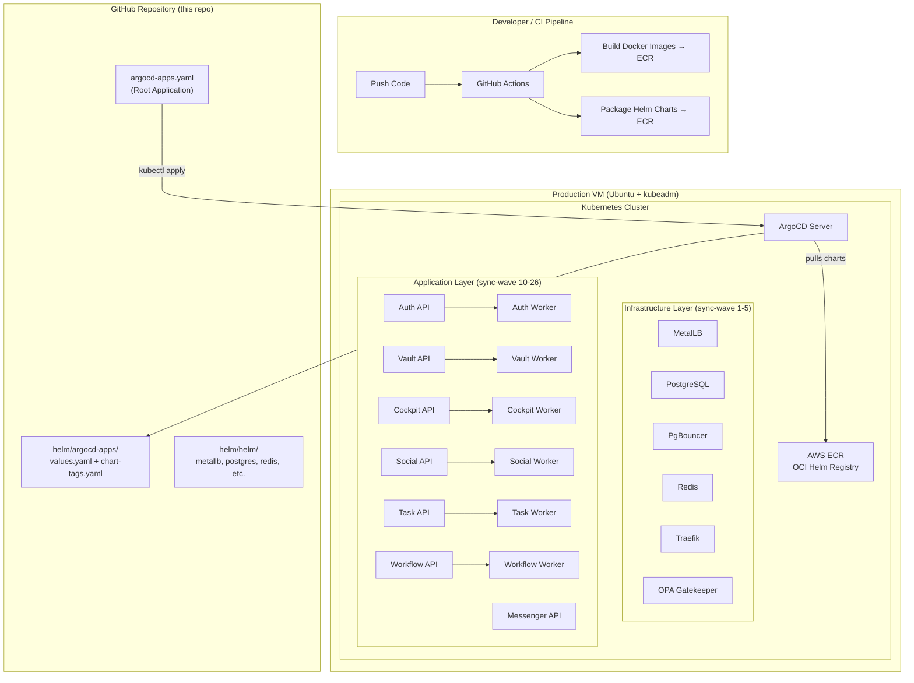

# NitroBerry Platform Infrastructure

> **GitOps-driven Kubernetes platform for the NitroBerry microservices ecosystem.**
> Single-command VM bootstrap → ArgoCD App-of-Apps → Full production cluster.

---

## Table of Contents

- [Overview](#overview)
- [Architecture](#architecture)
- [Repository Layout](#repository-layout)
- [Microservices Map](#microservices-map)
- [Prerequisites](#prerequisites)
- [Production Deployment Guide](#production-deployment-guide)
  - [Phase 1: Prepare AWS](#phase-1-prepare-aws)
  - [Phase 2: Configure Production Values](#phase-2-configure-production-values)
  - [Phase 3: Push Helm Charts to ECR](#phase-3-push-helm-charts-to-ecr)
  - [Phase 4: Bootstrap the VM](#phase-4-bootstrap-the-vm)
  - [Phase 5: Verify the Cluster](#phase-5-verify-the-cluster)
  - [Phase 6: Access ArgoCD Dashboard](#phase-6-access-argocd-dashboard)
- [Day-2 Operations](#day-2-operations)
- [Troubleshooting](#troubleshooting)
- [Security Notes](#security-notes)

---

## Overview

This repository owns the **entire Kubernetes platform layer** for NitroBerry. It provisions shared infrastructure and orchestrates the deployment of 7 microservices (each with an API + Worker) through a single GitOps pipeline.

**What this repo manages:**

| Category | Components |
|----------|-----------|
| **Cluster Bootstrap** | Single-node `kubeadm` cluster on Ubuntu VM, Calico CNI |
| **GitOps Engine** | ArgoCD with App-of-Apps pattern |
| **Networking** | MetalLB (LoadBalancer IPs), Traefik (Ingress + TLS + JWT middleware) |
| **Data Layer** | PostgreSQL, PgBouncer (connection pooling), Redis |
| **Security** | OPA Gatekeeper policies (6 constraint templates) |
| **ECR Automation** | CronJob-based ECR token refresher for ArgoCD and runtime namespaces |
| **Microservices** | Auth, Cockpit, Messenger, Social, Task, Vault, Workflow (API + Worker each) |

---

## Architecture



### How the App-of-Apps Pattern Works

```text
argocd-apps.yaml (Root Application)
  └── helm/argocd-apps/ (Helm chart that generates child Applications)
        ├── metallb          (sync-wave 1)  ← Infrastructure first
        ├── postgres         (sync-wave 2)
        ├── pgbouncer        (sync-wave 3)
        ├── redis            (sync-wave 3)
        ├── traefik          (sync-wave 4)
        ├── opa-gatekeeper   (sync-wave 5)
        ├── auth-api         (sync-wave 10) ← APIs next
        ├── vault-api        (sync-wave 11)
        ├── cockpit-api      (sync-wave 12)
        ├── social-api       (sync-wave 13)
        ├── task-api         (sync-wave 14)
        ├── messenger-api    (sync-wave 10)
        ├── workflow-api     (sync-wave 16)
        ├── auth-worker      (sync-wave 20) ← Workers last
        ├── vault-worker     (sync-wave 21)
        ├── cockpit-worker   (sync-wave 22)
        ├── social-worker    (sync-wave 23)
        ├── task-worker      (sync-wave 24)
        └── workflow-worker  (sync-wave 26)
```

Lower sync-wave numbers deploy first. Infrastructure is fully ready before any API starts, and all APIs are running before workers begin.

---

## Repository Layout

```text
.
├── README.md                          ← You are here
├── setup-vm.sh                        ← One-command VM bootstrap script
├── argocd-apps.yaml                   ← Root ArgoCD Application manifest
│
├── helm/
│   ├── ecr-helper.yaml                ← CronJob: auto-refreshes ECR tokens
│   ├── push-infra-charts.sh           ← Script: packages & pushes infra charts to ECR
│   │
│   ├── argocd-apps/                   ← App-of-Apps Helm chart
│   │   ├── Chart.yaml
│   │   ├── values.yaml                ← All application definitions + overrides
│   │   ├── chart-tags.yaml            ← Chart version pins (updated by CI)
│   │   └── templates/
│   │       └── applications.yaml      ← Template that generates ArgoCD Applications
│   │
│   └── helm/                          ← Infrastructure Helm charts
│       ├── metallb/
│       ├── postgres/
│       ├── pgbouncer/
│       ├── redis/
│       ├── traefik/
│       └── opa-gatekeeper/
```

---

## Microservices Map

| Service | ECR Helm Chart | Namespace | Health Probe | Notes |
|---------|---------------|-----------|-------------|-------|
| Auth API | `nitroberry/auth-api-helm` | `auth-namespace` | `/api/health` | Identity & authentication |
| Auth Worker | `nitroberry/auth-worker-helm` | `auth-namespace` | — | Background jobs |
| Vault API | `nitroberry/vault-api-helm` | `vault-namespace` | `/api/health` | Secure data storage |
| Vault Worker | `nitroberry/vault-worker-helm` | `vault-namespace` | — | Background jobs |
| Cockpit API | `nitroberry/cockpit-api-helm` | `cockpit-namespace` | `/api/health` | Admin control plane |
| Cockpit Worker | `nitroberry/cockpit-worker-helm` | `cockpit-namespace` | — | Background jobs |
| Social API | `nitroberry/social-api-helm` | `social-namespace` | `/api/health` | Social features |
| Social Worker | `nitroberry/social-worker-helm` | `social-namespace` | — | Background jobs |
| Task API | `nitroberry/task-api-helm` | `task-namespace` | `/api/health` | Task management |
| Task Worker | `nitroberry/task-worker-helm` | `task-namespace` | — | Background jobs |
| Messenger API | `nitroberry/messenger-api-helm` | `messenger-namespace` | `/socket.io/socket.io.js` | WebSocket-only (Socket.io) |
| Workflow API | `nitroberry/workflow-api-helm` | `workflow-namespace` | `/api/health` | Orchestration |
| Workflow Worker | `nitroberry/workflow-worker-helm` | `workflow-namespace` | — | Background jobs |

> **Note:** Messenger API uses Socket.io exclusively (no Express HTTP server), so its health probe targets the built-in Socket.io client script endpoint instead of `/api/health`.

---

## Prerequisites

### On Your Local Machine (or CI)

| Tool | Purpose | Install |
|------|---------|---------|
| AWS CLI v2 | ECR authentication | `aws --version` |
| Helm 3 | Chart packaging | `helm version` |
| Git | Repository access | `git --version` |
| kubectl | Cluster verification | `kubectl version` |

### On the Production VM

| Requirement | Details |
|-------------|---------|
| **OS** | Ubuntu 20.04+ (64-bit) |
| **RAM** | Minimum 8 GB (16 GB recommended) |
| **CPU** | Minimum 2 cores (4 recommended) |
| **Disk** | Minimum 50 GB |
| **Network** | Outbound access to GitHub, AWS ECR, and container registries |
| **AWS Credentials** | IAM user/role with ECR read/write permissions |

The `setup-vm.sh` script auto-installs: AWS CLI, Helm, kubeadm, kubelet, kubectl, containerd, ArgoCD, MetalLB, and OPA Gatekeeper.

### Required AWS IAM Permissions

```json
{
  "Effect": "Allow",
  "Action": [
    "sts:GetCallerIdentity",
    "ecr:GetAuthorizationToken",
    "ecr:DescribeRepositories",
    "ecr:CreateRepository",
    "ecr:BatchCheckLayerAvailability",
    "ecr:InitiateLayerUpload",
    "ecr:UploadLayerPart",
    "ecr:CompleteLayerUpload",
    "ecr:PutImage",
    "ecr:BatchGetImage"
  ],
  "Resource": "*"
}
```

---

## Production Deployment Guide

### Phase 1: Prepare AWS

**Step 1.1 — Verify AWS Access**

```bash
aws sts get-caller-identity
```

You should see your AWS Account ID, User ARN, and Account. If this fails, run `aws configure` first.

**Step 1.2 — Choose Your Region**

Default region: `ap-south-1`. If different, you will set `AWS_REGION` in later steps.

**Step 1.3 — Verify ECR Repositories Exist**

```bash
aws ecr describe-repositories --region ap-south-1 --query 'repositories[].repositoryName' --output table
```

You need these 19 ECR repositories under the `nitroberry/` prefix:

```text
# Infrastructure (6)
nitroberry/metallb-helm
nitroberry/postgres-helm
nitroberry/pgbouncer-helm
nitroberry/redis-helm
nitroberry/traefik-helm
nitroberry/opa-gatekeeper-helm

# Product APIs (7)
nitroberry/auth-api-helm
nitroberry/cockpit-api-helm
nitroberry/messenger-api-helm
nitroberry/social-api-helm
nitroberry/task-api-helm
nitroberry/vault-api-helm
nitroberry/workflow-api-helm

# Product Workers (6)
nitroberry/auth-worker-helm
nitroberry/cockpit-worker-helm
nitroberry/social-worker-helm
nitroberry/task-worker-helm
nitroberry/vault-worker-helm
nitroberry/workflow-worker-helm
```

---

### Phase 2: Configure Production Values

Before deploying, update these configuration files.

**Step 2.1 — MetalLB IP Range**

File: `helm/helm/metallb/values.yaml`

```yaml
# Replace with IPs available on your VM's network
pool:
  name: main-pool
  namespace: metallb-system
  addresses:
    - 10.0.1.240-10.0.1.250   # ← Change to your production IP range
```

> **Important:** The IP range must be routable on the same L2 network as the VM and not already assigned to other machines.

**Step 2.2 — Traefik TLS & JWT**

File: `helm/helm/traefik/values.yaml`

```yaml
traefik:
  acmeEmail: your-real-email@example.com   # ← For Let's Encrypt certificates

jwt:
  secret: YOUR_STRONG_JWT_SECRET           # ← Generate a strong secret
```

**Step 2.3 — ECR Repository URL**

File: `helm/argocd-apps/values.yaml` (line 4)

```yaml
global:
  ecrRepoUrl: <AWS_ACCOUNT_ID>.dkr.ecr.<REGION>.amazonaws.com/nitroberry
```

> The `setup-vm.sh` script auto-replaces this in `argocd-apps.yaml` at runtime, but update `values.yaml` manually for clarity.

**Step 2.4 — Chart Versions**

File: `helm/argocd-apps/chart-tags.yaml`

Ensure every version matches what is actually pushed to ECR:

```yaml
chartTags:
  metallb: "1.0.0"
  postgres: "1.0.0"
  pgbouncer: "1.0.0"
  redis: "1.0.0"
  traefik: "1.0.0"
  opa-gatekeeper: "1.0.0"
  auth-api: "0.0.6"        # ← Must match ECR chart version
  auth-worker: "0.0.6"
  cockpit-api: "0.0.2"
  cockpit-worker: "0.0.2"
  messenger-api: "0.0.1"
  social-api: "0.0.3"
  social-worker: "0.0.3"
  task-api: "0.0.3"
  task-worker: "0.0.3"
  vault-api: "0.0.3"
  vault-worker: "0.0.3"
  workflow-api: "0.0.3"
  workflow-worker: "0.0.3"
```

**Step 2.5 — Database Password**

The bootstrap script creates a default password. For production, either:
- Edit `setup-vm.sh` line 189 to use a strong password, **or**
- Create the secret manually before running the script:

```bash
kubectl create secret generic postgres-credentials \
  --from-literal=postgres-user=postgres \
  --from-literal=postgres-password='YOUR_STRONG_PASSWORD' \
  -n database-namespace
```

**Step 2.6 — ECR Helper Region**

File: `helm/ecr-helper.yaml`

```yaml
env:
  - name: AWS_DEFAULT_REGION
    value: "ap-south-1"    # ← Change if using a different region
```

**Step 2.7 — Commit All Changes**

```bash
git add -A
git commit -m "chore: configure production values"
git push origin argocdTest
```

---

### Phase 3: Push Helm Charts to ECR

**Step 3.1 — Lint Charts Locally**

```bash
helm lint helm/helm/metallb helm/helm/postgres helm/helm/pgbouncer \
         helm/helm/redis helm/helm/traefik helm/helm/opa-gatekeeper \
         helm/argocd-apps
```

Expected: `7 chart(s) linted, 0 chart(s) failed`

**Step 3.2 — Push Infrastructure Charts**

```bash
chmod +x helm/push-infra-charts.sh
./helm/push-infra-charts.sh ap-south-1
```

This script automatically:
1. Reads your AWS Account ID
2. Logs Helm into ECR
3. Creates missing ECR repositories
4. Lints, packages, and pushes each infrastructure chart

**Step 3.3 — Push Product Charts**

Product Helm charts (auth-api-helm, auth-worker-helm, etc.) are pushed from their respective service repositories via CI/CD (GitHub Actions). Ensure all 13 product charts exist in ECR before proceeding.

Verify:

```bash
aws ecr describe-repositories --region ap-south-1 \
  --query 'repositories[?starts_with(repositoryName, `nitroberry/`)].repositoryName' \
  --output table
```

---

### Phase 4: Bootstrap the VM

**Step 4.1 — SSH into the VM**

```bash
ssh ubuntu@<VM_PUBLIC_IP>
```

**Step 4.2 — Update System Packages**

```bash
sudo apt-get update -y
```

**Step 4.3 — Configure AWS Credentials**

```bash
aws configure
# Enter: Access Key ID, Secret Access Key, Region (ap-south-1), Output (json)

# Verify
aws sts get-caller-identity
```

The ECR token refresher CronJob runs as root, so copy credentials:

```bash
sudo mkdir -p /root/.aws
sudo cp -r ~/.aws/* /root/.aws/
sudo chmod -R 600 /root/.aws/*
sudo aws sts get-caller-identity
```

**Step 4.4 — Clone the Repository**

```bash
git clone https://github.com/dushyantajangid/NitroBerry-Platform.git
cd NitroBerry-Platform
git checkout argocdTest
```

**Step 4.5 — Run the Bootstrap Script**

```bash
chmod +x setup-vm.sh
export AWS_REGION="ap-south-1"
export GIT_REPO_URL="https://github.com/dushyantajangid/NitroBerry-Platform.git"
export GIT_BRANCH="argocdTest"
./setup-vm.sh
```

**What the script does (in order):**

| Step | Action |
|------|--------|
| 1 | Install base packages (curl, git, jq, gpg, etc.) |
| 2 | Install AWS CLI v2 (if missing) |
| 3 | Install Helm 3 (if missing) |
| 4 | Install kubeadm, kubelet, kubectl, containerd (if no cluster) |
| 5 | Initialize single-node Kubernetes cluster with `kubeadm` |
| 6 | Install Calico CNI |
| 7 | Untaint control-plane for single-node scheduling |
| 8 | Wait for node Ready |
| 9 | Clone repo and checkout branch |
| 10 | Install ArgoCD |
| 11 | Create ECR docker-registry secret for ArgoCD |
| 12 | Deploy ECR token refresher CronJob |
| 13 | Create `database-namespace` and Postgres credentials |
| 14 | Install MetalLB controller |
| 15 | Install OPA Gatekeeper controller |
| 16 | Apply `argocd-apps.yaml` → triggers the entire GitOps pipeline |

**Step 4.6 — Save the ArgoCD Admin Password**

The script prints it at the end. Save it securely:

```bash
kubectl -n argocd get secret argocd-initial-admin-secret \
  -o jsonpath='{.data.password}' | base64 -d && echo
```

---

### Phase 5: Verify the Cluster

Run these commands one by one to verify everything is healthy.

**Step 5.1 — Check Node Status**

```bash
kubectl get nodes
```

Expected: `STATUS = Ready`, `ROLES = control-plane`

**Step 5.2 — Check All Pods**

```bash
kubectl get pods -A
```

All pods should show `1/1 Running`. Expected namespaces:

```text
argocd               ← ArgoCD components (7 pods)
auth-namespace       ← auth-api + auth-worker
cockpit-namespace    ← cockpit-api + cockpit-worker
database-namespace   ← postgres + pgbouncer (x2) + redis
gatekeeper-system    ← gatekeeper-audit + controller-manager (x3)
kube-system          ← coredns, etcd, api-server, etc.
messenger-namespace  ← messenger-api
metallb-system       ← controller + speaker
social-namespace     ← social-api + social-worker
task-namespace       ← task-api + task-worker
traefik-ingress      ← traefik
vault-namespace      ← vault-api + vault-worker
workflow-namespace   ← workflow-api + workflow-worker
```

**Step 5.3 — Check ArgoCD Applications**

```bash
kubectl get applications -n argocd
```

Every application should show `Synced` and `Healthy`:

```text
NAME                       SYNC STATUS   HEALTH STATUS
auth-api                   Synced        Healthy
auth-worker                Synced        Healthy
cockpit-api                Synced        Healthy
cockpit-worker             Synced        Healthy
messenger-api              Synced        Healthy
metallb                    Synced        Healthy
nitroberry-platform-apps   Synced        Healthy
opa-gatekeeper             Synced        Healthy
pgbouncer                  Synced        Healthy
postgres                   Synced        Healthy
redis                      Synced        Healthy
social-api                 Synced        Healthy
social-worker              Synced        Healthy
task-api                   Synced        Healthy
task-worker                Synced        Healthy
traefik                    Synced        Healthy
vault-api                  Synced        Healthy
vault-worker               Synced        Healthy
workflow-api               Synced        Healthy
workflow-worker            Synced        Healthy
```

**Step 5.4 — Verify Database Connectivity**

```bash
# PostgreSQL
kubectl exec -n database-namespace postgres-0 -- \
  pg_isready -h postgres-service -p 5432 -U postgres
# Expected: "accepting connections"

# PgBouncer
kubectl exec -n database-namespace postgres-0 -- \
  pg_isready -h pgbouncer-service -p 6432 -U postgres
# Expected: "accepting connections"

# Redis
kubectl exec -n database-namespace deploy/redis -- redis-cli ping
# Expected: "PONG"
```

**Step 5.5 — Verify MetalLB & Traefik**

```bash
# MetalLB resources
kubectl get ipaddresspool,l2advertisement -n metallb-system

# Traefik external IP
kubectl get svc -n traefik-ingress traefik-service
# Expected: TYPE=LoadBalancer, EXTERNAL-IP=<IP from MetalLB range>
```

**Step 5.6 — Verify Gatekeeper Policies**

```bash
kubectl get constrainttemplates
kubectl get constraints
```

Expected 6 policies: `blocklatesttag`, `blockprivilegedcontainers`, `blockrootcontainers`, `requirelabels`, `requirereadonlyrootfs`, `requireresourcelimits`

---

### Phase 6: Access ArgoCD Dashboard

**Step 6.1 — Port Forward**

```bash
kubectl port-forward svc/argocd-server -n argocd 8080:443
```

**Step 6.2 — Open Browser**

```text
https://localhost:8080
```

**Step 6.3 — Login**

```text
Username: admin
Password: <from Step 4.6>
```

You should see all 20 applications in a green "Synced / Healthy" state.

---

## Day-2 Operations

### Updating a Platform Chart (MetalLB, Postgres, etc.)

```bash
# 1. Edit the chart
vim helm/helm/<chart-name>/templates/...

# 2. Bump version in Chart.yaml
vim helm/helm/<chart-name>/Chart.yaml   # version: 1.0.1

# 3. Update chart-tags.yaml to match
vim helm/argocd-apps/chart-tags.yaml    # e.g., postgres: "1.0.1"

# 4. Push to ECR
./helm/push-infra-charts.sh ap-south-1

# 5. Commit & push to Git
git add -A && git commit -m "bump postgres to 1.0.1" && git push

# 6. ArgoCD auto-syncs the new version
```

### Updating a Product Chart (auth-api, social-worker, etc.)

```bash
# 1. In the service repo: bump Chart.yaml version, build & push to ECR
# 2. In THIS repo: update chart-tags.yaml
vim helm/argocd-apps/chart-tags.yaml    # e.g., auth-api: "0.0.7"

# 3. Commit & push
git add -A && git commit -m "bump auth-api to 0.0.7" && git push

# 4. ArgoCD auto-syncs the new version from ECR
```

### Manually Refreshing ECR Tokens

```bash
kubectl create job --from=cronjob/ecr-token-refresher \
  ecr-token-refresher-manual -n argocd
kubectl logs -n argocd job/ecr-token-refresher-manual
```

### Force-Refreshing ArgoCD

```bash
kubectl annotate application -n argocd nitroberry-platform-apps \
  argocd.argoproj.io/refresh=hard --overwrite
```

---

## Troubleshooting

### ArgoCD Application Shows "Unknown" Sync Status

```bash
kubectl describe application <app-name> -n argocd
kubectl logs -n argocd deploy/argocd-repo-server --tail=100
```

**Common causes:**
- Private Git repo without credentials configured in ArgoCD
- ECR token expired (run the manual refresh job above)
- Chart version in `chart-tags.yaml` doesn't exist in ECR
- ECR Helm repository doesn't exist

### Pod CrashLoopBackOff

```bash
kubectl describe pod <pod-name> -n <namespace>
kubectl logs <pod-name> -n <namespace>
kubectl logs <pod-name> -n <namespace> --previous   # previous crash logs
```

**Common causes:**
- Health probe returning 401 → probe path needs `/api/health` prefix
- Health probe timeout → check if the service uses Socket.io (use `/socket.io/socket.io.js`)
- Missing ConfigMap/Secret → check if the namespace has the required config

### ECR Unauthorized Errors

```bash
aws sts get-caller-identity
sudo aws sts get-caller-identity
kubectl get secret ecr-regcred -n argocd
kubectl get cronjob ecr-token-refresher -n argocd
```

### MetalLB External IP Stuck on `<pending>`

```bash
kubectl get pods -n metallb-system
kubectl get ipaddresspool,l2advertisement -n metallb-system
kubectl describe svc traefik-service -n traefik-ingress
```

Check that the IP range in `helm/helm/metallb/values.yaml` is valid for your network.

### Gatekeeper Policy Chart Fails

Gatekeeper CRDs must be established before constraints can be applied. ArgoCD sync waves handle this automatically. For manual testing:

```bash
# Apply once to create CRDs
helm template opa-gatekeeper-local helm/helm/opa-gatekeeper | kubectl apply -f -
# Wait for CRDs
kubectl wait --for=condition=Established crd --all --timeout=180s
# Apply again to create constraints
helm template opa-gatekeeper-local helm/helm/opa-gatekeeper | kubectl apply -f -
```

### ArgoCD ApplicationSet Controller High Restart Count

```bash
kubectl get crd applicationsets.argoproj.io
```

If missing:

```bash
kubectl apply --server-side \
  -f https://raw.githubusercontent.com/argoproj/argo-cd/stable/manifests/crds/applicationset-crd.yaml
```

---

## Security Notes

| Risk | Mitigation |
|------|-----------|
| AWS credentials in Git | **Never commit** real AWS keys. Use IAM roles or environment variables. |
| Database passwords | Replace default `nitroberry-prod-db-pass` before production. Use a secrets manager. |
| JWT secret | Replace `REPLACE_WITH_JWT_SECRET` with a cryptographically strong value. |
| AWS credentials on VM | Protect `/root/.aws` with `chmod 600`. Prefer IAM instance roles. |
| ArgoCD admin password | Change the default password after first login. |
| Private Git repos | Register credentials as ArgoCD repository secrets (not in plain YAML). |

For mature production environments, consider: AWS Secrets Manager, External Secrets Operator, Sealed Secrets, or SOPS for all secret management.
