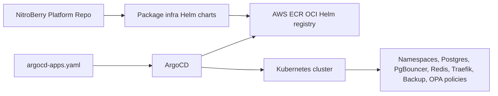

# NitroBerry Platform Infrastructure

This repository now owns the Kubernetes platform layer only. API and worker Helm charts are expected to live with their respective application repositories.

## Current Responsibility

- Creates only platform infrastructure namespaces. Application namespaces are owned by the application repositories.
- Deploys platform infrastructure Helm charts for MetalLB config, Postgres, PgBouncer, Redis, Traefik, Postgres S3 backup, and OPA Gatekeeper policies.
- Defines ArgoCD `Application` resources that pull those infrastructure charts from AWS ECR as OCI Helm charts.
- Keeps production secret values out of Git. Runtime secrets are created by `setup-vm.sh` or should be supplied by your production secret-management system.

## Helm Chart Layout

```text
Helm/
  charts/
    nitroberry/
      namespaces/
      metallb/
      postgres/
      pgbouncer/
      redis/
      traefik/
      postgres-backup/
      opa-gatekeeper/
  push-infra-charts.sh
```

## ECR Helm Repositories

Each chart is packaged locally and pushed to AWS ECR as an OCI Helm chart. Helm pushes to the parent OCI path:

```bash
helm push postgres-0.1.0.tgz \
  oci://798701233691.dkr.ecr.ap-south-1.amazonaws.com/nitroberry
```

Because Helm appends the chart name, ECR must have repositories like:

```bash
aws ecr create-repository --repository-name nitroberry/namespaces --region ap-south-1
aws ecr create-repository --repository-name nitroberry/metallb --region ap-south-1
aws ecr create-repository --repository-name nitroberry/postgres --region ap-south-1
aws ecr create-repository --repository-name nitroberry/pgbouncer --region ap-south-1
aws ecr create-repository --repository-name nitroberry/redis --region ap-south-1
aws ecr create-repository --repository-name nitroberry/traefik --region ap-south-1
aws ecr create-repository --repository-name nitroberry/postgres-backup --region ap-south-1
aws ecr create-repository --repository-name nitroberry/opa-gatekeeper --region ap-south-1
```

The helper script creates missing repositories and pushes all infrastructure charts:

```bash
./Helm/push-infra-charts.sh ap-south-1
```

## ArgoCD Flow



`argocd-apps.yaml` points ArgoCD to ECR, not to local YAML files. App API and worker deployments should be controlled by their own application repos and ArgoCD apps.

## VM Bootstrap

Run this on the target Ubuntu VM:

```bash
chmod +x setup-vm.sh
./setup-vm.sh
```

The script:

- Installs base tools only when missing.
- Installs Kubernetes only when no reachable cluster is found.
- Installs Helm only when missing.
- Installs ArgoCD if it is not already present.
- Installs external controllers with Helm: MetalLB, Gatekeeper, and Traefik CRDs when available.
- Creates runtime secrets in Kubernetes instead of storing secret values in Git.
- Pushes infrastructure Helm charts to ECR.
- Applies `argocd-apps.yaml` so ArgoCD starts syncing the infra charts.

## Secrets

Do not commit real secret values to this repo. Production values should live in one of these places:

- Kubernetes Secrets created by the bootstrap process.
- AWS Secrets Manager plus External Secrets Operator.
- Sealed Secrets or SOPS-encrypted values if the team wants Git-managed encrypted secrets.

This repo should contain only placeholders, chart templates, and non-sensitive configuration.

## Production Notes

- Update the MetalLB IP range in `Helm/charts/nitroberry/metallb/values.yaml` for the VM/network.
- Replace the default Traefik ACME email and JWT middleware secret through chart values before production.
- Ensure app repos create their own API/worker ConfigMaps, Secrets, image tags, and ArgoCD Applications.
- ArgoCD's ECR OCI token is bootstrapped by `setup-vm.sh`; for long-running production, use a token refresh job or a secret-management integration so ECR credentials do not expire.
