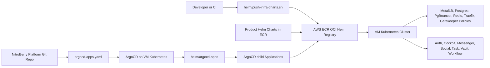

# NitroBerry Platform Infrastructure

This repository owns the Kubernetes platform layer for NitroBerry. It installs the shared infrastructure that the API and worker applications need before they are deployed.

The platform includes:

- Kubernetes bootstrap for a single Ubuntu VM.
- ArgoCD GitOps bootstrap.
- AWS ECR OCI Helm chart publishing.
- MetalLB for `LoadBalancer` services on a VM.
- Postgres, PgBouncer, Redis, Traefik, and OPA Gatekeeper policies.
- ECR token refresh automation for ArgoCD and runtime namespaces.
- ArgoCD application definitions for product Helm charts stored in ECR.

Application API and worker Helm chart source can live in their own application repositories. This repo defines the ArgoCD applications that pull those packaged Helm charts from ECR.

## Architecture



## Repository Layout

```text
.
├── setup-vm.sh
├── argocd-apps.yaml
├── helm/
│   ├── push-infra-charts.sh
│   ├── ecr-helper.yaml
│   ├── argocd-apps/
│   │   ├── Chart.yaml
│   │   ├── values.yaml
│   │   ├── chart-tags.yaml
│   │   └── templates/applications.yaml
│   └── helm/
│       ├── metallb/
│       ├── postgres/
│       ├── pgbouncer/
│       ├── redis/
│       ├── traefik/
│       └── opa-gatekeeper/
```

## Production Setup Overview

Production setup happens in this order:

1. Prepare AWS credentials.
2. Update production values in this repo.
3. Push platform Helm charts to AWS ECR.
4. Run `setup-vm.sh` on the Ubuntu VM.
5. ArgoCD reads `argocd-apps.yaml`.
6. ArgoCD renders `helm/argocd-apps`.
7. The child ArgoCD apps pull platform charts from ECR.
8. The child ArgoCD apps pull product API/worker charts from ECR.
9. Kubernetes creates platform and product resources.
10. Verify all pods, services, ArgoCD apps, MetalLB, and Gatekeeper policies.

## Required Tools

On your local machine or CI machine that pushes charts:

```bash
aws --version
helm version
git --version
```

On the production Ubuntu VM, `setup-vm.sh` installs most required tools automatically, including AWS CLI, Helm, Kubernetes packages, containerd, ArgoCD, MetalLB, and Gatekeeper.

## Step 1: Prepare AWS

Choose the AWS region. The current default is:

```text
ap-south-1
```

The AWS identity must have permissions for:

- `sts:GetCallerIdentity`
- `ecr:GetAuthorizationToken`
- `ecr:DescribeRepositories`
- `ecr:CreateRepository`
- `ecr:BatchCheckLayerAvailability`
- `ecr:InitiateLayerUpload`
- `ecr:UploadLayerPart`
- `ecr:CompleteLayerUpload`
- `ecr:PutImage`
- `ecr:BatchGetImage`

Check AWS access:

```bash
aws sts get-caller-identity
```

Expected output should show your AWS account ID.

## Step 2: Update Production Values

Before running production, update the files below.

### 2.1 MetalLB IP Range

File:

```text
helm/helm/metallb/values.yaml
```

Current value:

```yaml
pool:
  addresses:
    - 192.168.49.200-192.168.49.250
```

This `192.168.49.x` range is for Minikube-style local testing. For production, replace it with IP addresses available on the VM network.

Example:

```yaml
pool:
  name: main-pool
  namespace: metallb-system
  addresses:
    - 10.0.1.240-10.0.1.250
```

Use an IP range that:

- Belongs to the same reachable network as the VM.
- Is not already used by another machine.
- Is allowed by your cloud/firewall/network setup.
- Can be routed to the VM.

If you are using a cloud VM with only one public IP and no routable private range for MetalLB, do not guess this value. Use your cloud networking design first.

### 2.2 Traefik Settings

File:

```text
helm/helm/traefik/values.yaml
```

Update the ACME email:

```yaml
traefik:
  acmeEmail: admin@nitroberry.com
```

Change it to a real email:

```yaml
traefik:
  acmeEmail: your-email@example.com
```

Update the JWT middleware secret:

```yaml
jwt:
  secret: REPLACE_WITH_JWT_SECRET
```

For production, do not leave `REPLACE_WITH_JWT_SECRET`. Use a strong secret value or move this into a secret-management system.

### 2.3 ECR Repo URL

File:

```text
helm/argocd-apps/values.yaml
```

Current value:

```yaml
global:
  ecrRepoUrl: 798701233691.dkr.ecr.ap-south-1.amazonaws.com/nitroberry
```

During VM bootstrap, `setup-vm.sh` replaces the account and region in `argocd-apps.yaml`. The child app chart also has a default ECR URL in `helm/argocd-apps/values.yaml`.

For clarity, update this value to your AWS account and region before pushing to Git:

```yaml
global:
  ecrRepoUrl: <AWS_ACCOUNT_ID>.dkr.ecr.<AWS_REGION>.amazonaws.com/nitroberry
```

Example:

```yaml
global:
  ecrRepoUrl: 123456789012.dkr.ecr.ap-south-1.amazonaws.com/nitroberry
```

### 2.4 Chart Versions

File:

```text
helm/argocd-apps/chart-tags.yaml
```

Current values:

```yaml
chartTags:
  metallb: "1.0.0"
  postgres: "1.0.0"
  pgbouncer: "1.0.0"
  redis: "1.0.0"
  traefik: "1.0.0"
  opa-gatekeeper: "1.0.0"
  auth-api: "1.0.0"
  auth-worker: "1.0.0"
  cockpit-api: "1.0.0"
  cockpit-worker: "1.0.0"
  messenger-api: "1.0.0"
  social-api: "1.0.0"
  social-worker: "1.0.0"
  task-api: "1.0.0"
  task-worker: "1.0.0"
  vault-api: "1.0.0"
  vault-worker: "1.0.0"
  workflow-api: "1.0.0"
  workflow-worker: "1.0.0"
```

These versions must match the Helm chart versions pushed to ECR. For platform charts, the source is in this repo:

```text
helm/helm/<chart-name>/Chart.yaml
```

For product charts, the source may live in the service repo, but the packaged chart must exist in ECR with the same version tag.

If you change a chart and bump its `Chart.yaml` version, update the matching value in `chart-tags.yaml`.

### 2.5 Product ArgoCD Applications

File:

```text
helm/argocd-apps/values.yaml
```

This file now creates ArgoCD apps for these product Helm charts:

```text
auth-api-helm              -> auth-namespace
auth-worker-helm           -> auth-namespace
cockpit-api-helm           -> cockpit-namespace
cockpit-worker-helm        -> cockpit-namespace
messenger-api-helm         -> messenger-namespace
social-api-helm            -> social-namespace
social-worker-helm         -> social-namespace
task-api-helm              -> task-namespace
task-worker-helm           -> task-namespace
vault-api-helm             -> vault-namespace
vault-worker-helm          -> vault-namespace
workflow-api-helm          -> workflow-namespace
workflow-worker-helm       -> workflow-namespace
```

These names must match your ECR Helm repositories:

```text
nitroberry/auth-api-helm
nitroberry/auth-worker-helm
nitroberry/cockpit-api-helm
nitroberry/cockpit-worker-helm
nitroberry/messenger-api-helm
nitroberry/social-api-helm
nitroberry/social-worker-helm
nitroberry/task-api-helm
nitroberry/task-worker-helm
nitroberry/vault-api-helm
nitroberry/vault-worker-helm
nitroberry/workflow-api-helm
nitroberry/workflow-worker-helm
```

No `messenger-worker-helm` app is configured because that repository was not present in the ECR list. Add it later only after the ECR Helm repository exists.

Product sync waves are ordered for internal dependencies:

```text
10  auth-api          identity/authentication first
11  vault-api         secure data service after auth
12  cockpit-api       admin/control plane API after auth
13  social-api        domain API after auth
14  task-api          domain API after auth/social foundations
15  messenger-api     messaging API after auth/social/task foundations
16  workflow-api      orchestration API after core domain APIs
20  auth-worker       workers start after all APIs begin syncing
21  vault-worker
22  cockpit-worker
23  social-worker
24  task-worker
26  workflow-worker
```

If a real service dependency is different, change the `syncWave` value in:

```text
helm/argocd-apps/values.yaml
```

Lower waves sync earlier. Higher waves sync later.

### 2.6 Git Repo and Branch

File:

```text
setup-vm.sh
```

Defaults:

```bash
GIT_REPO_URL="${GIT_REPO_URL:-https://github.com/dushyantajangid/NitroBerry-Platform.git}"
GIT_BRANCH="${GIT_BRANCH:-argocdTest}"
```

You can either edit these defaults or pass them when running the script:

```bash
export GIT_REPO_URL="https://github.com/dushyantajangid/NitroBerry-Platform.git"
export GIT_BRANCH="argocdTest"
```

If the GitHub repository is public, ArgoCD does not need Git credentials. If it is private, add Git credentials to ArgoCD after bootstrap.

### 2.7 AWS Region

File:

```text
setup-vm.sh
```

Default:

```bash
AWS_REGION_DEFAULT="${AWS_REGION_DEFAULT:-ap-south-1}"
```

You can keep this or pass the region during setup:

```bash
export AWS_REGION="ap-south-1"
```

Also check:

```text
helm/ecr-helper.yaml
```

Current value:

```yaml
env:
  - name: AWS_DEFAULT_REGION
    value: "ap-south-1"
```

If your production region is not `ap-south-1`, update this value too.

### 2.8 Postgres Bootstrap Password

File:

```text
setup-vm.sh
```

Current bootstrap secret:

```bash
kubectl create secret generic postgres-credentials \
  --from-literal=postgres-user=postgres \
  --from-literal=postgres-password=nitroberry-prod-db-pass \
  -n database-namespace --dry-run=client -o yaml | kubectl apply -f -
```

For real production, replace `nitroberry-prod-db-pass` before running the script, or create the `postgres-credentials` secret from a secure secret-management flow.

Do not commit real production passwords to Git.

## Step 3: Validate Charts Locally

Run from the repository root:

```bash
helm lint helm/helm/metallb helm/helm/postgres helm/helm/pgbouncer helm/helm/redis helm/helm/traefik helm/helm/opa-gatekeeper helm/argocd-apps
```

Expected result:

```text
7 chart(s) linted, 0 chart(s) failed
```

The message `Chart.yaml: icon is recommended` is informational only. It is not a failure.

## Step 4: Push Platform Charts to ECR

File:

```text
helm/push-infra-charts.sh
```

This script uses:

```bash
CHART_ROOT="${CHART_ROOT:-helm/helm}"
```

That path is correct for this repository. The older path `Helm/charts/nitroberry` is not used anymore.

Run:

```bash
chmod +x helm/push-infra-charts.sh
./helm/push-infra-charts.sh ap-south-1
```

The script will:

1. Read the AWS account ID.
2. Log Helm into ECR.
3. Create missing ECR repositories.
4. Lint each chart.
5. Package each chart.
6. Push each chart to ECR.

It pushes these platform repositories:

```text
nitroberry/metallb-helm
nitroberry/postgres-helm
nitroberry/pgbouncer-helm
nitroberry/redis-helm
nitroberry/traefik-helm
nitroberry/opa-gatekeeper-helm
```

Product Helm charts are not packaged from this repo unless you add their chart source here. Push product Helm charts from their own service repositories or CI pipelines. They must end up in ECR with the names listed in `helm/argocd-apps/values.yaml`.

Required product Helm repositories:

```text
nitroberry/auth-api-helm
nitroberry/auth-worker-helm
nitroberry/cockpit-api-helm
nitroberry/cockpit-worker-helm
nitroberry/messenger-api-helm
nitroberry/social-api-helm
nitroberry/social-worker-helm
nitroberry/task-api-helm
nitroberry/task-worker-helm
nitroberry/vault-api-helm
nitroberry/vault-worker-helm
nitroberry/workflow-api-helm
nitroberry/workflow-worker-helm
```

Check ECR:

```bash
aws ecr describe-repositories --region ap-south-1
```

## Step 5: Prepare the Ubuntu VM

SSH into the VM:

```bash
ssh ubuntu@<VM_PUBLIC_IP>
```

Update packages:

```bash
sudo apt-get update -y
```

Clone the repo:

```bash
git clone https://github.com/dushyantajangid/NitroBerry-Platform.git
cd NitroBerry-Platform
git checkout argocdTest
```

If your branch is different, replace `argocdTest`.

## Step 6: Configure AWS on the VM

The setup script needs AWS access. Configure AWS for the user running the script:

```bash
aws configure
aws sts get-caller-identity
```

The ECR token refresher CronJob currently mounts AWS credentials from:

```text
/root/.aws
```

So root also needs AWS credentials. The simple setup is:

```bash
sudo mkdir -p /root/.aws
sudo cp -r ~/.aws/* /root/.aws/
sudo chmod -R 600 /root/.aws/*
```

Then verify:

```bash
sudo aws sts get-caller-identity
```

If you use IAM roles instead of static credentials, update `helm/ecr-helper.yaml` so the CronJob can access AWS using your chosen production identity method.

## Step 7: Run VM Bootstrap

From the repository root on the VM:

```bash
chmod +x setup-vm.sh
export AWS_REGION="ap-south-1"
export GIT_REPO_URL="https://github.com/dushyantajangid/NitroBerry-Platform.git"
export GIT_BRANCH="argocdTest"
./setup-vm.sh
```

The script will:

1. Install base packages.
2. Install AWS CLI if missing.
3. Install Helm if missing.
4. Install Kubernetes packages if no cluster exists.
5. Initialize a single-node Kubernetes cluster with `kubeadm`.
6. Install Calico CNI.
7. Untaint the control-plane node so workloads can run.
8. Clone the platform repo and checkout the configured branch.
9. Install ArgoCD.
10. Create the ArgoCD ECR secret.
11. Apply `helm/ecr-helper.yaml`.
12. Create `database-namespace`.
13. Create the Postgres credentials secret.
14. Install MetalLB controller and CRDs.
15. Install Gatekeeper controller and CRDs.
16. Apply `argocd-apps.yaml`.
17. ArgoCD starts syncing platform and product child apps from ECR.

## Step 8: Verify Kubernetes

Check nodes:

```bash
kubectl get nodes
```

Expected:

```text
STATUS   ROLES           ...
Ready    control-plane   ...
```

Check all pods:

```bash
kubectl get pods -A
```

Important namespaces should be running:

```text
argocd
auth-namespace
cockpit-namespace
database-namespace
gatekeeper-system
kube-system
messenger-namespace
metallb-system
social-namespace
task-namespace
traefik-ingress
vault-namespace
workflow-namespace
```

## Step 9: Verify ArgoCD

Check applications:

```bash
kubectl get applications -n argocd
```

Healthy production target:

```text
Synced   Healthy
```

If you see:

```text
Unknown   Healthy
```

then ArgoCD can see the application object, but it cannot calculate the sync status. Common reasons:

- Git repo is private and credentials are missing.
- ECR credentials are missing or expired.
- ECR charts were not pushed.
- `chart-tags.yaml` references a chart version that does not exist in ECR.
- ArgoCD repo-server cannot reach GitHub or ECR from the VM network.
- A product chart app points to an ECR Helm repository that does not exist.

Find the exact reason:

```bash
kubectl describe application nitroberry-platform-apps -n argocd
kubectl logs -n argocd statefulset/argocd-application-controller --tail=100
kubectl logs -n argocd deploy/argocd-repo-server --tail=100
```

## Step 10: Verify Database and Cache

Postgres:

```bash
kubectl exec -n database-namespace postgres-0 -- pg_isready -h postgres-service -p 5432 -U postgres
```

Expected:

```text
postgres-service:5432 - accepting connections
```

PgBouncer:

```bash
kubectl exec -n database-namespace postgres-0 -- pg_isready -h pgbouncer-service -p 6432 -U postgres
```

Expected:

```text
pgbouncer-service:6432 - accepting connections
```

Redis:

```bash
kubectl exec -n database-namespace deploy/redis -- redis-cli ping
```

Expected:

```text
PONG
```

## Step 11: Verify MetalLB and Traefik

Check MetalLB:

```bash
kubectl get pods -n metallb-system
kubectl get ipaddresspool,l2advertisement -n metallb-system
```

Check Traefik:

```bash
kubectl get svc -n traefik-ingress traefik-service
```

Expected:

```text
TYPE           EXTERNAL-IP
LoadBalancer   <IP_FROM_METALLB_RANGE>
```

If `EXTERNAL-IP` stays `<pending>`, check:

- `helm/helm/metallb/values.yaml` IP range.
- MetalLB controller and speaker pods.
- Whether the IP range is valid for the VM network.

## Step 12: Verify Gatekeeper

Check controller:

```bash
kubectl get pods -n gatekeeper-system
```

Check policies:

```bash
kubectl get constrainttemplates
kubectl get constraints
```

Expected:

```text
blocklatesttag
blockprivilegedcontainers
blockrootcontainers
requirelabels
requirereadonlyrootfs
requireresourcelimits
```

## Step 13: Open ArgoCD UI

Port-forward:

```bash
kubectl port-forward svc/argocd-server -n argocd 8080:443
```

Get the admin password:

```bash
kubectl -n argocd get secret argocd-initial-admin-secret \
  -o jsonpath='{.data.password}' | base64 -d
```

Open:

```text
https://localhost:8080
```

Login:

```text
username: admin
password: <command output>
```

## Updating Platform Charts Later

When you change a platform chart:

1. Edit files under:

```text
helm/helm/<chart-name>/
```

2. Bump the chart version:

```text
helm/helm/<chart-name>/Chart.yaml
```

Example:

```yaml
version: 1.0.1
```

3. Update:

```text
helm/argocd-apps/chart-tags.yaml
```

Example:

```yaml
chartTags:
  postgres: "1.0.1"
```

4. Push charts:

```bash
./helm/push-infra-charts.sh ap-south-1
```

5. Commit and push Git changes.

6. ArgoCD will sync the new version.

When you change a product chart:

1. Bump that product chart version in its service repository.
2. Package and push that product chart to ECR.
3. Update the matching key in:

```text
helm/argocd-apps/chart-tags.yaml
```

Example:

```yaml
chartTags:
  auth-api: "1.0.1"
```

4. Commit and push this repo.
5. ArgoCD will sync the product app from ECR.

## Troubleshooting

### Helm lint passes but ArgoCD is Unknown

Run:

```bash
kubectl describe application nitroberry-platform-apps -n argocd
kubectl logs -n argocd deploy/argocd-repo-server --tail=100
```

Most likely causes are Git or ECR access.

### ECR Unauthorized

Check:

```bash
aws sts get-caller-identity
sudo aws sts get-caller-identity
kubectl get secret ecr-regcred -n argocd
kubectl get cronjob ecr-token-refresher -n argocd
```

Refresh manually:

```bash
kubectl create job --from=cronjob/ecr-token-refresher ecr-token-refresher-manual -n argocd
kubectl logs -n argocd job/ecr-token-refresher-manual
```

### MetalLB External IP Pending

Run:

```bash
kubectl get pods -n metallb-system
kubectl get ipaddresspool,l2advertisement -n metallb-system
kubectl describe svc traefik-service -n traefik-ingress
```

Then confirm the IP range in:

```text
helm/helm/metallb/values.yaml
```

### Gatekeeper Policy Chart Fails in Plain Helm

The Gatekeeper policy chart creates `ConstraintTemplate` objects and custom constraints. Gatekeeper must generate the constraint CRDs before the constraints can be applied.

ArgoCD sync waves handle this better than a single plain `helm upgrade --install`. For local manual testing, apply in two passes:

```bash
helm template opa-gatekeeper-local helm/helm/opa-gatekeeper | kubectl apply -f -
kubectl wait --for=condition=Established \
  crd/requireresourcelimits.constraints.gatekeeper.sh \
  crd/requirelabels.constraints.gatekeeper.sh \
  crd/blockprivilegedcontainers.constraints.gatekeeper.sh \
  crd/blockrootcontainers.constraints.gatekeeper.sh \
  crd/requirereadonlyrootfs.constraints.gatekeeper.sh \
  crd/blocklatesttag.constraints.gatekeeper.sh \
  --timeout=180s
helm template opa-gatekeeper-local helm/helm/opa-gatekeeper | kubectl apply -f -
```

### ArgoCD ApplicationSet Controller Restarts

Check whether the ApplicationSet CRD exists:

```bash
kubectl get crd applicationsets.argoproj.io
```

If missing:

```bash
kubectl apply --server-side \
  -f https://raw.githubusercontent.com/argoproj/argo-cd/stable/manifests/crds/applicationset-crd.yaml
```

## Local Test Commands Used

These commands were used to verify the platform locally with Minikube:

```bash
helm lint helm/helm/metallb helm/helm/postgres helm/helm/pgbouncer helm/helm/redis helm/helm/traefik helm/helm/opa-gatekeeper helm/argocd-apps
kubectl get pods -A
kubectl get all -A
kubectl exec -n database-namespace postgres-0 -- pg_isready -h postgres-service -p 5432 -U postgres
kubectl exec -n database-namespace postgres-0 -- pg_isready -h pgbouncer-service -p 6432 -U postgres
kubectl exec -n database-namespace deploy/redis -- redis-cli ping
kubectl get ipaddresspool,l2advertisement -n metallb-system
kubectl get constrainttemplates
kubectl get constraints
```

Expected important outputs:

```text
7 chart(s) linted, 0 chart(s) failed
postgres-service:5432 - accepting connections
pgbouncer-service:6432 - accepting connections
PONG
```

## Security Notes

- Do not commit real AWS keys.
- Do not commit production database passwords.
- Do not leave `REPLACE_WITH_JWT_SECRET` in production.
- Prefer IAM roles, AWS Secrets Manager, External Secrets Operator, Sealed Secrets, or SOPS for mature production secret handling.
- If you use static AWS credentials for the current implementation, protect `/root/.aws` on the VM.
