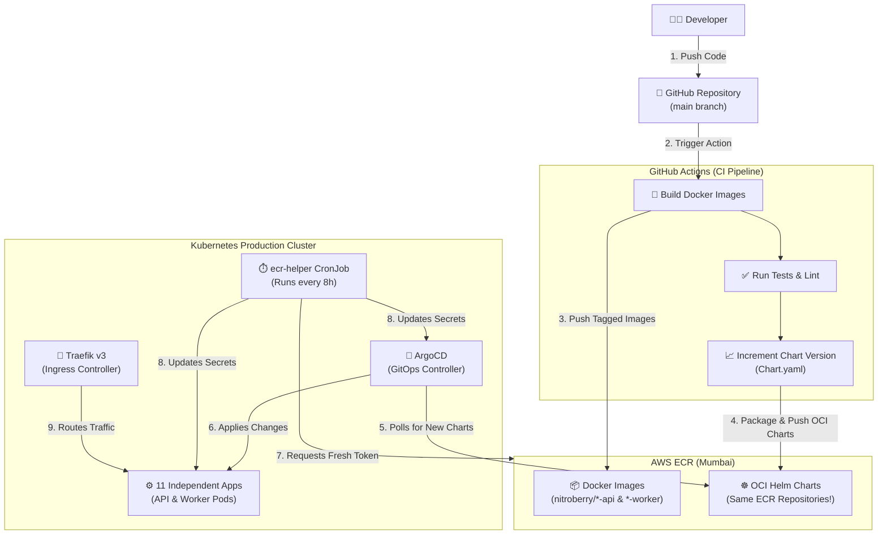

# NitroBerry — Production-Ready Kubernetes Microservices Architecture

<div align="center">
  <p><strong>A complete, bare-metal Kubernetes GitOps deployment guide.</strong></p>
</div>

---

## 📋 Table of Contents
- [Overview](#overview)
- [Full Architecture Diagram & GitOps Flow](#full-architecture-diagram--gitops-flow)
- [Phase 1: Prerequisites](#phase-1-prerequisites)
- [Phase 2: AWS ECR Repository Setup](#phase-2-aws-ecr-repository-setup)
- [Phase 3: Kubernetes Core Infrastructure Setup](#phase-3-kubernetes-core-infrastructure-setup)
- [Phase 4: ArgoCD Installation & Configuration](#phase-4-argocd-installation--configuration)
- [Phase 5: The CI/CD Pipeline (GitHub Actions)](#phase-5-the-cicd-pipeline-github-actions)
- [Production Checklist](#production-checklist)
- [Troubleshooting](#troubleshooting)

---

## 🌟 Overview
NitroBerry is a **bare-metal, production-grade Kubernetes platform** that runs **seven microservices** (Auth, Cockpit, Messenger, Social, Task, Vault, Workflow). 

Each microservice is deployed using its own independent **Helm chart**. For most services, there is an **API** container and a **Worker** container. 

This repository relies on a **100% automated GitOps flow**:
1. You push code to GitHub.
2. GitHub Actions builds the Docker images and the Helm charts.
3. Both the images and Helm charts are pushed to **AWS ECR (Elastic Container Registry)**.
4. **ArgoCD** (running inside your Kubernetes cluster) automatically detects the new Helm charts and updates your live production environment. **You never run `kubectl apply` for application updates.**

---

## 📐 Full Architecture Diagram & GitOps Flow

Below is the complete **GitOps workflow** detailing how code travels from a developer's machine to the production Kubernetes cluster.



---

## 🚀 Phase 1: Prerequisites

Before touching the production cluster, ensure you have:
1. **A Kubernetes Cluster** (v1.28+) running.
2. **`kubectl`** installed on your local machine and connected to your cluster.
3. **AWS CLI** installed and configured with an IAM user that has `AmazonEC2ContainerRegistryFullAccess`.
4. **A Registered Domain** (e.g., `nitroberry.com`) with a Wildcard DNS record (`*.nitroberry.com`) pointing to your cluster's public LoadBalancer IP.

---

## 📦 Phase 2: AWS ECR Repository Setup

AWS ECR (Elastic Container Registry) acts as our storage for both Docker images and Helm charts. 

In this architecture, **the Docker image and its corresponding Helm chart are pushed to the exact same repository** (except for `auth`, which has a dedicated helm repo).

If you haven't created them yet, run these commands in your terminal to create the required AWS ECR repositories:

```bash
# Auth Service (Special Case: Separate Helm Repos)
aws ecr create-repository --repository-name nitroberry/auth-api --region ap-south-1
aws ecr create-repository --repository-name nitroberry/auth-api-helm --region ap-south-1
aws ecr create-repository --repository-name nitroberry/auth-worker --region ap-south-1
aws ecr create-repository --repository-name nitroberry/auth-worker-helm --region ap-south-1

# Cockpit Service
aws ecr create-repository --repository-name nitroberry/cockpit-api --region ap-south-1
aws ecr create-repository --repository-name nitroberry/cockpit-worker --region ap-south-1

# Messenger Service
aws ecr create-repository --repository-name nitroberry/messenger-api --region ap-south-1

# Social Service
aws ecr create-repository --repository-name nitroberry/social-api --region ap-south-1
aws ecr create-repository --repository-name nitroberry/social-worker --region ap-south-1

# Task Service
aws ecr create-repository --repository-name nitroberry/task-api --region ap-south-1
aws ecr create-repository --repository-name nitroberry/task-worker --region ap-south-1

# Vault Service
aws ecr create-repository --repository-name nitroberry/vault-api --region ap-south-1
aws ecr create-repository --repository-name nitroberry/vault-worker --region ap-south-1

# Workflow Service
aws ecr create-repository --repository-name nitroberry/workflow-api --region ap-south-1
aws ecr create-repository --repository-name nitroberry/workflow-worker --region ap-south-1
```

---

## 🏗 Phase 3: Kubernetes Core Infrastructure Setup

Before we deploy our apps, we need to set up the foundation of our cluster. We will apply manifests from the `Legacy yaml/` directory (or wherever your core manifests reside).

### Step 3.1: Create Namespaces
```bash
kubectl apply -f "Legacy yaml/00-namespaces.yaml"
```

### Step 3.2: Install MetalLB (Load Balancer)
Bare-metal clusters do not have built-in LoadBalancers like AWS/GCP do. MetalLB fixes this.
```bash
# 1. Install MetalLB components
kubectl apply -f https://raw.githubusercontent.com/metallb/metallb/v0.13.10/manifests/namespace.yaml
kubectl apply -f https://raw.githubusercontent.com/metallb/metallb/v0.13.10/manifests/metallb.yaml

# 2. Wait for the pods to be running
kubectl get pods -n metallb-system

# 3. Apply your specific IP Pool configuration
# (IMPORTANT: Open `Legacy yaml/01-metallb.yaml` and edit the IP range to match your network before running this!)
kubectl apply -f "Legacy yaml/01-metallb.yaml"
```

### Step 3.3: Install Traefik v3 (Ingress Controller)
Traefik acts as the "front door", routing internet traffic (like `auth.nitroberry.com`) to the correct internal pod.
```bash
kubectl apply -f "Legacy yaml/03-traefik-rbac.yaml"
kubectl apply -f "Legacy yaml/04-traefik-install.yaml"
kubectl apply -f "Legacy yaml/05-traefik-middlewares.yaml"
```

### Step 3.4: Install Databases (Postgres & Redis)
```bash
kubectl apply -f "Legacy yaml/02-postgres.yaml"
# If you have PgBouncer and Redis manifests, apply them here as well
```

### Step 3.5: Configure Secrets
Open `Legacy yaml/12-secrets.yaml`. This file contains placeholders like `REPLACE_WITH_STRONG_PASSWORD`. 
1. Generate real passwords.
2. Update the file.
3. Apply it to the cluster:
```bash
kubectl apply -f "Legacy yaml/12-secrets.yaml"
```

---

## 🦑 Phase 4: ArgoCD Installation & Configuration

ArgoCD is the brain of our GitOps flow. It lives inside the cluster and pulls our configurations from AWS ECR.

### Step 4.1: Install ArgoCD
```bash
kubectl create namespace argocd
kubectl apply -n argocd -f https://raw.githubusercontent.com/argoproj/argo-cd/stable/manifests/install.yaml

# Wait for all ArgoCD pods to be Running
kubectl get pods -n argocd
```

### Step 4.2: Give ArgoCD access to AWS ECR
AWS ECR tokens expire every 12 hours. We use a **CronJob** to automatically refresh this token so ArgoCD never loses access.

1. Create the initial token manually:
```bash
kubectl create secret generic ecr-regcred \
  --docker-server=798701233691.dkr.ecr.ap-south-1.amazonaws.com \
  --docker-username=AWS \
  --docker-password=$(aws ecr get-login-password --region ap-south-1) \
  -n argocd
```

2. Apply the automated refresh CronJob:
```bash
kubectl apply -f Helm/charts/nitroberry/templates/ecr-helper.yaml
```

### Step 4.3: Deploy the NitroBerry Apps via ArgoCD
We have prepared a master file (`argocd-apps.yaml`) that tells ArgoCD about all 11 of our Helm charts.
```bash
kubectl apply -f argocd-apps.yaml
```
Once applied, ArgoCD will immediately reach out to AWS ECR, pull the Helm charts, and deploy your entire architecture!

---

## ⚙️ Phase 5: The CI/CD Pipeline (GitHub Actions)

When you are ready to make a code change, you don't need to touch the server.

1. **Commit your code** to the `main` branch.
2. **GitHub Actions** will automatically trigger. You can watch the progress in the "Actions" tab on GitHub.
3. The pipeline will:
   - Run your unit tests.
   - Build a new Docker image for the service you changed.
   - Tag it (e.g., `0.0.0.52`).
   - Push the image to AWS ECR.
   - Automatically edit the `Chart.yaml` file to increment the version.
   - Package the Helm chart and push it as an OCI artifact to AWS ECR.
   - Commit the updated `Chart.yaml` back to GitHub.
4. Within 3 minutes, **ArgoCD** will notice the new Helm chart version in ECR and automatically upgrade your live pods with zero downtime (Rolling Update).

---

## ✅ Production Checklist

Before officially going live, ensure you have:
- [ ] Changed the MetalLB IP pool to match your public/private network block.
- [ ] Replaced all database passwords in `12-secrets.yaml` with securely generated ones.
- [ ] Replaced the JWT secret with a base64 encoded string.
- [ ] Updated the `host:` fields in your Helm `values.yaml` files to match your real domain (e.g., `auth.yourdomain.com`).
- [ ] Pointed your DNS provider (Route53, Cloudflare, etc.) to the Traefik LoadBalancer IP.

---

## 🛠 Troubleshooting

**Q: My Pods are stuck in `ImagePullBackOff`.**
A: Your Kubernetes nodes don't have permission to pull the images from AWS ECR. Verify that the `ecr-regcred` secret exists in the pod's namespace. The `ecr-helper` CronJob should create this automatically.

**Q: ArgoCD says "Failed to fetch OCI chart".**
A: The ArgoCD repository credentials have expired. Check if the `ecr-helper` CronJob in the `argocd` namespace is running successfully every 8 hours.

**Q: I pushed code but my pods didn't update.**
A: Check GitHub Actions to ensure the workflow passed. Then, check the ArgoCD UI. If ArgoCD says "Synced", ensure that the `appVersion` in your `Chart.yaml` actually updated to match the new Docker image tag.

---
<div align="center">
  <b>Happy Deploying! 🚀</b>
</div>
